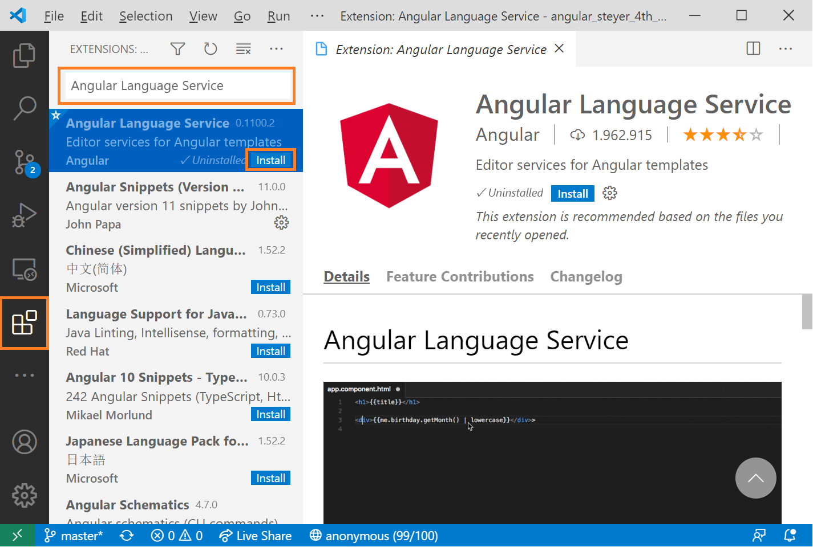
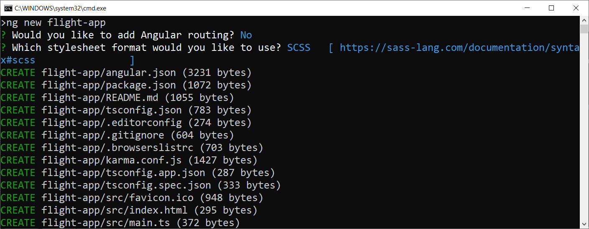
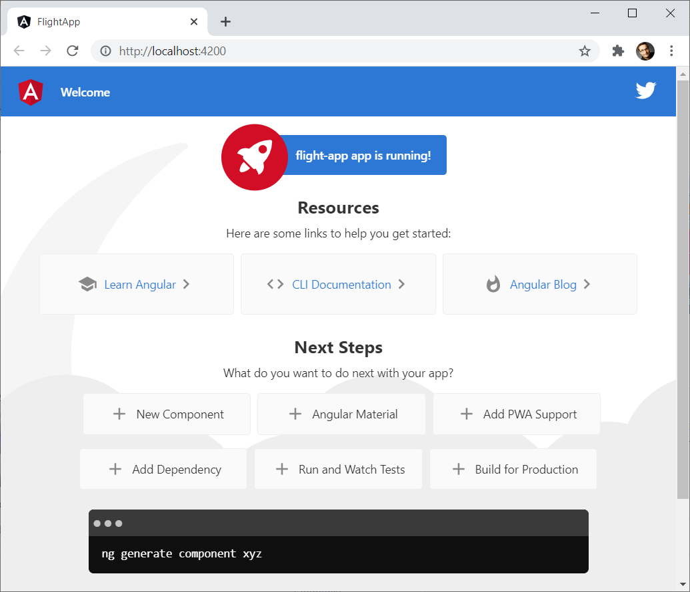
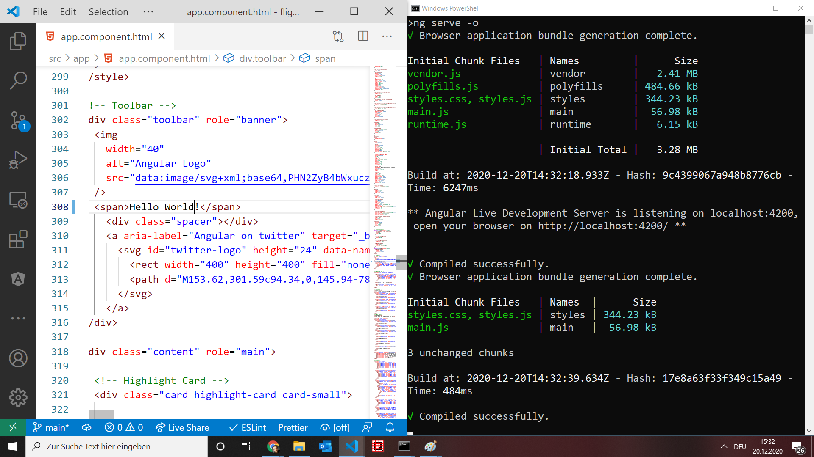
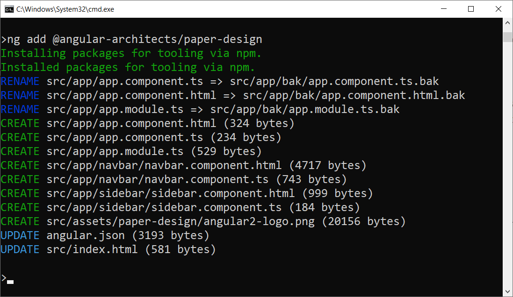
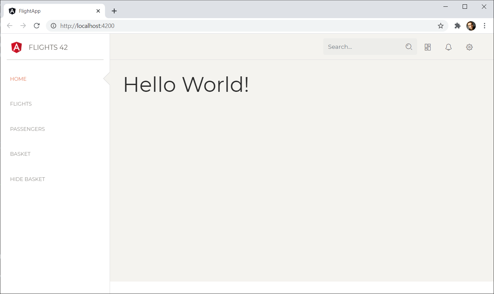

# Erste Schritte mit Angular

## Bevor es losgeht: Werkzeuge installieren

Bevor wir mit Ihrer ersten Angular-Anwendung loslegen können, müssen wir erst mal ein paar Werkzeuge einrichten.

### Visual Studio Code

Wir nutzen in diesem Buch die freie Entwicklungsumgebung [Visual Studio Code](https://code.visualstudio.com). Sie funktioniert auf allen wichtigen Betriebssystemen (Linux, OSX, Windows) und ist äußerst leichtgewichtig. Visual Studio Code unterstützt ab Werk die Sprache TypeScript.

Außerdem existieren zahlreiche Erweiterungen, die die Arbeit mit Frameworks wie Angular vereinfachen. Um Erweiterungen zu installieren, klicken Sie auf das Symbol ``Extensions`` in der linken Symbolleiste. Anschließend können Sie nach Erweiterungen suchen und diese installieren:



Für die Entwicklung von Angular-Lösungen empfehlen wir die folgenden Erweiterungen:

- **Angular Language Service:** Der Angular Language Service wird vom Angular-Team bereitgestellt und erlaubt Angular-bezogene Codevervollständigungen in HTML-Templates. Außerdem weist der Language Service auch auf mögliche Fehler in HTML-Templates hin.

- **Angular Schematics**: Erlaubt das Generieren von Building-Blocks wie Angular-Komponenten über das Kontextmenü von Visual Studio Code.

- **Debugger for Chrome**: Erlaubt das Debuggen von JavaScript-Anwendungen, die in Chrome ausgeführt werden.

> Neben Visual Studio Code haben wir auch mit den kommerziellen Produkten  WebStorm, PhpStorm bzw. IntelliJ von Jetbrains (https://www.jetbrains.com/) sehr gute Erfahrungen gemacht. 

### Angular CLI

Um keine Zeit mit dem Einrichten aller benötigten Werkzeuge zu
verlieren, bietet das Angular-Team das sogenannte Angular Commandline Interface, kurz [Angular CLI](https://cli.angular.io), an. Die CLI generiert nicht nur das Grundgerüst der Anwendung, sondern auf Wunsch auch die Grundgerüste weiterer Anwendungsbestandteile wie z. B. Komponenten.

Außerdem kümmert sie sich um das Konfigurieren des TypeScript-Compilers und einer Build-Konfiguration zur Erzeugung optimierter Bundles. Werkzeuge für die Testautomatisierung richtet die CLI ebenfalls ein.

Die CLI lässt sich leicht über den Package-Manager ``npm`` beziehen, der sich im Lieferumfang von [Node.js](https://nodejs.org) befindet. Außerdem nutzt die CLI Node.js als Laufzeitumgebung. Wir haben gute Erfahrungen mit den jeweiligen Long-Term-Support-Versionen (LTS-Versionen) gemacht. Der Einsatz älterer Versionen kann zu Problemen führen.

Sobald Node.js installiert ist, kann die CLI mittels ``npm`` eingerichtet werden:

```
npm install -g @angular/cli
```

Der Schalter ``-g`` bewirkt, dass +npm+ das Werkzeug systemweit, also
global, einrichtet, sodass es überall zur Verfügung steht. Ohne diesen Schalter würde ``npm`` das adressierte Paket lediglich für ein lokales Projekt im aktuellen Ordner einrichten. Nach der Installation steht die CLI über das Kommando ``ng`` zur Verfügung.

## Eine neue Angular-Application erzeugen

Ein Aufruf von

```bash
ng new flight-app
```

generiert das Grundgerüst einer neuen Angular-Anwendung, die den Namen ``flight-app`` erhält. Dazu stellt uns die CLI ein paar Fragen:



Je nach Angular-Version können diese Fragestellungen etwas variieren. Wir gehen hier von folgenden Einstellungen aus:

- **Add Angular Routing**: Diese Frage beantworten wir hier mit ``No``. Um das Thema Routing kümmern wir uns in einem späteren Kapitel.

- **Stylesheet Format**: Wir empfehlen hier SCSS, eine Übermenge von CSS. Die Angular CLI kompiliert diese Dateien für den Browser nach CSS.

Da ``ng new`` auch zahlreiche Pakete via ``npm`` bezieht, kann der Aufruf etwas länger dauern. 

## Ihre Angular-Anwendung starten

Um Ihre Anwendung zu starten, wechseln Sie in den generierten Projektordner. Dabei handelt es sich um jenen Ordner, der auch die Datei ``angular.json`` enthält. Ein Aufruf von ``ng serve`` startet die Anwendung in einem Demo-Webserver:

```bash
cd flight-app
ng serve -o
```

Der Schalter ``-o`` öffnet einen Browser, der die Anwendung anzeigt. Standardmäßig findet sich diese Anwendung unter ``http://localhost:4200``. Ist Port ``4200`` schon belegt, erkundigt sich ``ng serve`` nach einer Alternative. Außerdem nimmt der Schalter ``--port`` den gewünschten Port gleich beim Start von ``ng serve`` entgegen:

```bash
ng serve -o --port 4242
```

Die im Browser angezeigte Anwendung sieht wie folgt aus:



Auch hier kann es von Version zu Version zu Abweichungen kommen.

Der für die Entwicklung gedachte Befehl ``ng serve`` macht aber noch ein wenig mehr: Er überwacht sämtliche Quellcodedateien und stößt das Kompilieren sowie Generieren der Bundles
erneut an, wenn sie sich ändern. Danach aktualisiert er auch das Browserfenster. 

Um das auszuprobieren, können Sie mit Visual Studio Code die Datei ``src\app\app.component.html`` öffnen und z. B. das erste Vorkommen von Welcome durch ``Hello World!`` ersetzen. Daraufhin sollte ``ng serve`` den betroffenen Teil der Anwendung neu kompilieren, bundeln und den Browser aktualisieren:



Die automatische Generierung der Bundles nach einer Änderung am
Programmcode funktioniert meist ganz gut, aber ab und an kommt die CLI
aus dem Tritt. Das ist unter anderem dann der Fall, wenn Sie mehrere Dateien rasch hintereinander speichern. Auch das Umbenennen von Dateien bringt diesen Mechanismus aus dem Konzept. 

Abhilfe schafft hier ein erneutes Speichern der betroffenen Dateien oder – wenn alle Stricke reißen – ein Neustart von ``ng serve``.

## Build mit CLI

Während ``ng serve`` für die Entwicklung sehr komfortabel ist, eignet es sich nicht für den Produktionseinsatz. Um Bundles für die Produktion zu generieren, nutzen Sie die Anweisung

```bash
ng build
```

Seit Angular CLI 12 führt ``ng build`` zahlreiche Optimierungen, die zu kleineren Bundles führen, automatisch durch. Davor musste man diese Optimierungen explizit mit dem Schalter ``--prod`` anfordern. 

Ein Beispiel für eine solche Optimierung ist die Minifizierung, bei der unnötige Zeichen wie Kommentare oder Zeilenschaltungen entfernt sowie Ihre Anweisungen durch kürzere Gegenstücke ersetzt werden. Ein weiteres Beispiel ist das sogenannte Tree-Shaking, das nicht benötigte Framework-Bestandteile identifiziert und entfernt. Diese Optimierungen verlangsamen natürlich den Build-Prozess ein wenig. 

Die generierten Bundles finden sich im Ordner ``dist/flight-app``. Im Rahmen der Bereitstellung müssen Sie diese Dateien lediglich auf den Webserver Ihrer Wahl kopieren. Da es sich aus Sicht des Webservers hierbei um eine statische Webanwendung handelt, müssen Sie dort auch keine zusätzliche Skriptsprache und kein Web-Framework installieren. 


## Das generierte Projekt erkunden

Lassen Sie uns nun ein paar der generierten Programmdateien unter ``src/app`` etwas genauer betrachten. Starten wir dabei mit der generierten ``AppComponent``. Es handelt sich dabei um jene Komponente, die Angular beim Programmstart anzeigt. Wie die meisten Angular-Komponenten besteht sie aus mehreren Dateien:

- ``app.component.ts``: TypeScript-Datei, die das Verhalten der Komponente definiert.

- ``app.component.html``: HTML-Datei mit der Struktur der Komponente.

- ``app.component.scss``: Datei mit lokalen Styles für die Komponente. Allgemeine Styles können in die besprochene ``styles.scss`` eingetragen werden.

Bei der ``app.component.ts`` handelt es sich um eine einfache Klasse mit einer Eigenschaft ``title``:

```typescript
import { Component } from '@angular/core';

@Component({
  selector: 'app-root',
  templateUrl: './app.component.html', 
  styleUrls: ['./app.component.scss']
})
export class AppComponent { 
  title = 'flight-app';
}
```

Der ``title`` ist vom Typ ``string``. Letzteres muss hier gar nicht explizit angeben werden: TypeScript kann sich diesen Umstand aus dem zugewiesenen Standardwert herleiten. 

Die Angabe von ``export`` definiert, dass die Klasse auch in anderen Dateien der Anwendung genutzt werden darf.

Die Klasse wurde mit dem Dekorator ``Component`` versehen. Dekoratoren definieren Metadaten für Programmkonstrukte wie z. B. Klassen. Der ``Component`` teilt beispielsweise Angular mit, dass diese Klasse eine Komponente repräsentiert. Das Programmcode importiert den Dekorator in der ersten Zeile aus dem Paket ``@angular/core``.

Die Metadaten im Dekorator beinhalten den Selektor der Komponente. Das ist in der Regel der Name eines HTML-Elements, das die Komponente repräsentiert. Um die Komponente aufzurufen, können Sie also die folgende Schreibweise in einer HTML-Datei verwenden:

```html
<app-root></app-root>
```

Der Dekorator verweist außerdem auf das HTML-Template der Komponente und ihre SCSS-Datei mit lokalen Styles. Letztere ist standardmäßig leer. Die HTML-Datei beinhaltet den Code für die oben betrachtete Startseite. Die ist zwar schön, enthält aber eine Menge HTML-Markup. Ersetzen Sie mal zum Ausprobieren den **gesamten** Inhalt dieser HTML-Datei durch folgendes Fragment:


```html
<h1>{{title}}</h1>
```

Wenn Sie nun die Anwendung starten (falls noch nicht geschehen: ``ng serve -o``), sollten Sie den Inhalt der Eigenschaft ``title`` als Überschrift sehen. Die beiden geschweiften Klammernpaare definieren eine sogenannte Datenbindung. Angular bindet also die angegebene Eigenschaft an die jeweilige Stelle im Template.

Mehr Informationen zu Datenbindungen finden Sie in den nächsten beiden Kapiteln. Um diesen Rundgang durch die generierten Programmdateien abzuschließen, möchten wir jedoch noch auf drei weitere generierte Dateien hinweisen. Eine davon ist die Datei ``app.module.ts``, die ein Angular-Modul beinhaltet:

```typescript
import { BrowserModule } from '@angular/platform-browser';
import { NgModule } from '@angular/core';
import { AppComponent } from './app.component';

@NgModule({
  declarations: [
    AppComponent
  ],
  imports: [
    BrowserModule
  ],
  providers: [],
  bootstrap: [AppComponent]
})
export class AppModule { }
```

Angular-Module sind Datenstrukturen, die zusammengehörige Building-Blocks wie Komponenten zusammenfassen. Technisch gesehen, handelt es sich dabei um eine weitere Klasse. Sie ist in den meisten Fällen leer und dient lediglich als Träger von Metadaten, die über den ``NgModule``-Dekorator angegeben werden.

Lassen Sie uns einen Blick auf die Eigenschaften von +NgModule+ werfen:

- **declarations**: Definiert die Inhalte des Moduls. Derzeit beschränken diese sich auf unsere ``AppComponent``. Sie wird in der dritten Zeile unter Angabe eines relativen Pfads, der auf die Datei ``app.component.ts`` verweist, importiert. Die Dateiendung ``.ts`` wird hierbei weggelassen.
  
- **imports**: Importiert weitere Module. Das gezeigte Beispiel importiert lediglich das ``BrowserModule``, das alles beinhaltet, um Angular im Browser auszuführen. Das ist auch der Standardfall.

- **providers**: Hier könnte man sogenannte Services, die Logiken für mehrere Komponenten anbieten, registrieren. Kapitel XY geht darauf ein.

- **bootstrap**: Diese Eigenschaft verweist auf sämtliche Komponenten, die beim Start der Anwendung zu erzeugen sind. Häufig handelt es sich dabei lediglich um eine einzige Komponente. Diese sogenannte Root-Component repräsentiert die gesamte Anwendung und ruft dazu weitere Komponenten auf.

Das Modul, das die Root-Component bereitstellt, wird auch als Root-Module bezeichnet. Angular nimmt es beim Start der Anwendung entgegen und rendert die darin zu findende Root-Component. Diese Komponente ist in der ``index.html`` aufzurufen:


```html
<body>
  <app-root></app-root>
</body>
```

Sowohl ``ng serve`` als auch ``ng build`` ergänzen diese ``index.html`` auch um Verweise auf die erzeugten JavaScript-Bundles, die unseren Quellcode enthalten.

## Programmieren mit "Stil": Bootstrap installieren

Da auch "das Auge mitprogrammiert", wollen wir an dieser Stelle ein paar vordefinierte Styles ins Spiel bringen. Wir nutzen hier die populäre Stylesheet-Bibliothek ``Bootstrap``. 

> Der Vorteil von Bootstrap liegt neben seiner äußerst weiten Verbreitung in der Tatsache, dass es unaufdringlich ist. Es definiert lediglich ein paar (S)CSS-Klassen, die man auf bekannte HTML-Elemente anwenden kann. Im Gegensatz zu anderen Lösungen muss man also zunächst keine weiteren HTML-Elemente erlernen.

Da das Standard-Design von Bootstrap ein wenig langweilig ist, nutzen wir auch ein freies Bootstrap Theme. Es nennt sich Paper-Design und kommt von [Creative Tim](https://www.creative-tim.com). Dazu könnten Sie nun natürlich Bootstrap via npm installieren und die CSS-Dateien des Themes in Ihr Projekt kopieren. 

Um diese Aufgabe ein wenig zu vereinfachen, haben wir ein Meta-Paket bereitgestellt. Sie können es einfach via ``ng add`` installieren:

```bash
ng add @angular-architects/paper-design 
```    

Bei ``ng add`` handelt es sich um einen Mechanismus der CLI, der beim Hinzufügen von Paketen hilft. Er installiert ein Paket und führt ein Skript aus, das das Paket einrichtet. Natürlich könnte man die dazu notwenigen Schritte auch manuell ausführen. 

Die Ausführung von ``ng add`` gestaltet sich wie folgt:



Wie Sie hier sehen, verschiebt dieser Befehl die ``AppComponent`` und das ``AppModule`` in den Ordner ``bak`` (siehe Zeilen mit ``RENAME``). Danach generiert er die beiden erneut im Ordner ``src/app``. Außerdem generiert er eine ``NavbarComponent`` und eine ``SideBarComponent`` für die Navigation. 

Danach erweitert dieser Aufruf von ``ng add`` die Dateien ``angular.json`` und ``index.html``. Erstere erhält Verweise auf die Style-Dateien von Bootstrap und dem freien Paper Design-Theming von Creative Tim:

```json
"styles": [
	"node_modules/@angular-architects/paper-design/assets/css/bootstrap.css",
	"node_modules/@angular-architects/paper-design/assets/scss/paper-dashboard.scss",
	"src/styles.scss"
],
```

In diesem Listing sieht man übrigens auch die von ``ng new`` generiere Datei ``src/styles.scss``, in der Sie Ihre eigenen globalen Styles hinterlegen können. 

Die ``index.html`` erhält zwei ``link``-Elemente zum Laden des vom Theming verwendeten Webfonts.

> Leider liest ``ng serve`` globale Konfigurationsdateien wie die ``angular.json`` nur beim Programmstart. Falls ``ng serve`` bereits läuft, müssen Sie es deswegen beenden (``Strg+C``) und neu starten.  

Startet man die Anwendung erneut mit ``ng serve -o``, ergibt sich das folgende Bild:



Links sieht man die generierte ``SideBarComponent`` und im oberen Bereich die ebenfalls generierte ``NavBarComponent``. Sämtliche Links sind derzeit noch Dummies – aber das wird sich im Laufe des Buchs noch ändern.

> Tipp: Werfen Sie einen Blick auf den Quellcode der beiden generierten Komponenten und der in der ``angular.json`` erzeugten Einträge. Wie schon erwähnt, könnten Sie diese Dateien auch manuell einrichten und erweitern. Da das jedoch in der Regel monoton und fehleranfällig ist, freuen wir uns über ``ng add``.


## Zusammenfassung

Die Angular CLI hilft beim Einrichten, Ausführen und Bauen von Angular-Projekten. Es genügt ein einfaches ``ng new``, und schon können Sie loslegen. Wie bei jedem generierten Projekt-Setup müssen Sie sich jedoch ein wenig Zeit nehmen, um sich mit den generierten Dateien vertraut zu machen. 
