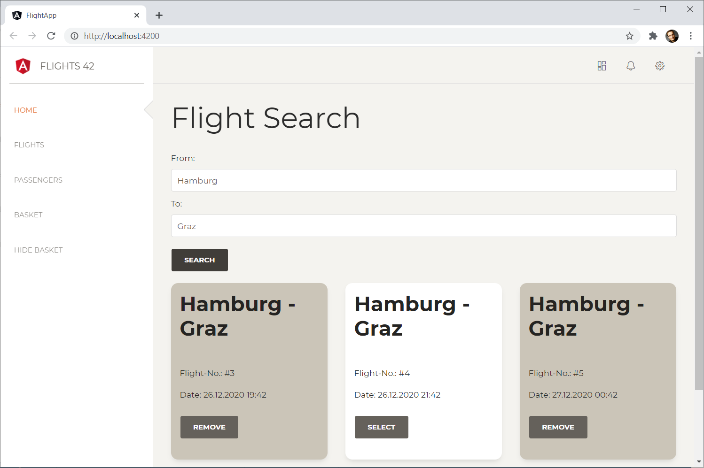
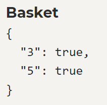
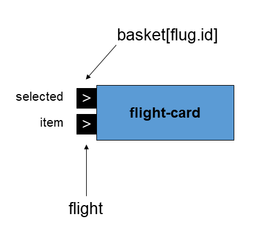
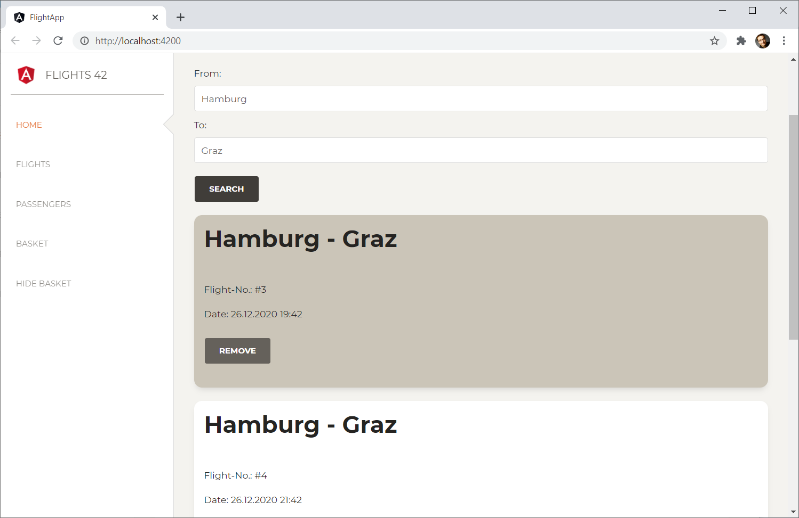
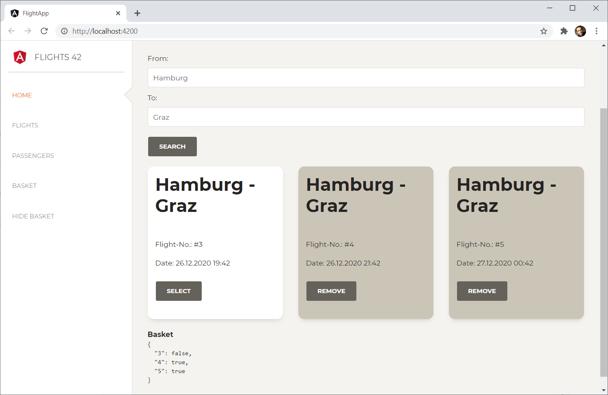
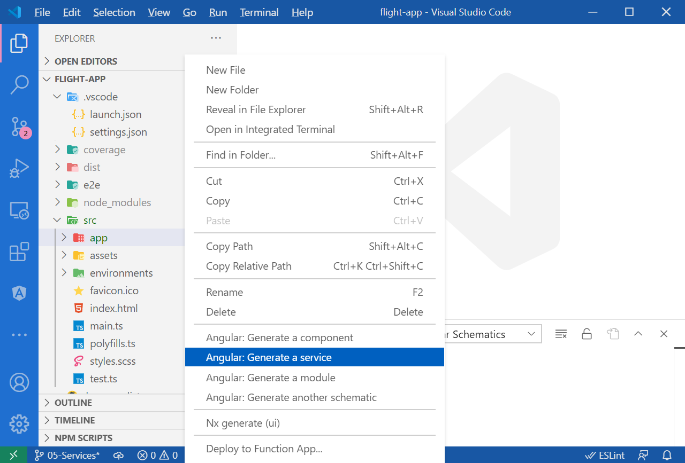
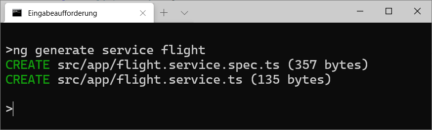

# Die Anwendung verfeinern: Wiederverwendbare Sub-Komponenten und Services

In diesem Kapitel wollen wir unsere Lösung mit Boardmittel von Angular ein wenig verfeinern. Dazu lagern wir wiederverwendbare UI-Fragmente in eine Sub-Komponente und eine wiederverwendbare Logik in einen Service aus.

## Sub-Komponenten mit Event- und Property-Bindings

Jede Angular-Komponente kann weitere Komponenten in ihrem Template aufrufen. Zur Kommunikation kommen dazu die aus dem letzten Kapitel bekannten Property- und Event-Bindings zum Einsatz. Um dies zu veranschaulichen, kommt hier eine Sub-Komponente, die Flüge in Form von Karten präsentiert zum Einsatz:



Solche Karten sind derzeit sehr üblich, zumal sie ein flexibles (*responsive*) Design erlauben: Steht am Endgerät viel Platz zur Verfügung, kann eine Anwendung mehrere Karten nebeneinander anzeigen. Steht wenig Platz zur Verfügung, zeigt die Anwendung die Karten untereinander an.

### Vorbereitungen

Jede Karte kann ausgewählt werden. Wurde sie ausgewählt, erhält sie einen beigen Hintergrund, ansonsten einen weißen. Außerdem sollen alle ausgewählten Flüge im Warenkorb präsentiert werden. Dazu wird der Warenkorb auf ein Objekt abgeändert, das die IDs der Flüge auf einen `boolean` abbildet:

```typescript
[...]
export class FlightSearchComponent implements OnInit {

    from = 'Hamburg';
    to = 'Graz';
    flights: Array<Flight> = [];
    selectedFlight: Flight | null = null;

    basket: { [key: number]: boolean } = {
        3: true,
        5: true
    };

    [...]

}
```

Im gezeigten Beispiel befinden sich von Anfang an die Flüge 3 und 5 im Warenkorb. Das soll das Ausprobieren unserer Anwendung ein wenig vereinfachen.

Der Datentyp von `basket` verdient unsere Aufmerksamkeit: `{ [key: number]: boolean }` bedeutet, dass es sich hierbei um ein Objekt handelt, das Schlüssel vom Typ `number` auf Werte vom Typ `boolean` abbildet. Das Objekt wird also als Dictionary verwendet.

> Falls Ihnen die hier verwendete Schreibweise zu unübersichtlich ist, können Sie auch in einem vorgelagerten Schritt einen Typ für das Dictionary definieren und dann `basket` damit typisieren:
> 
> ```typescript
> type NumberBooleanDict = { [key: number]: boolean };
>
>     [...]
>
>     export class FlightSearchComponent implements OnInit {
>       [...]
>       basket: NumberBooleanDict = {
>         3: true,
>         5: true
>       }
>       [...]
>     }
> ```

Um festzustellen, ob sich ein Flug im Warenkorb befindet, muss die Anwendung also nur prüfen, ob der Basket an der Stelle der *FlugId* *truthy* ist:

```typescript
const inBasket = this.basket[7]; // 7 ist eine FlugId.
```

Zur Visualisierung des Warenkorbs kommt aus Gründen der Vereinfachung abermals die JSON-Pipe zum Einsatz:

```json
{{ basket | json }}
```

Das Ganze gestaltet sich dann, wie nachfolgend gezeigt:



### Eine Komponente mit Property-Bindings Property-Binding

Die hier besprochene Karte, deren Implementierung im nächsten Abschnitt folgt, soll über Property-Bindings zwei Informationen vom Parent übergeben bekommen: den anzuzeigenden Flug und die Information, ob sie ausgewählt wurde. Für die erste Information weist die Komponente eine Eigenschaft `item` und für zweite Information eine Eigenschaft `selected` auf:

```html
<div *ngFor="let f of flights">
    <app-flight-card [item]="f" [selected]="basket[f.id]">
    </app-flight-card>
</div>
```

Um alle gefundenen Flüge auszugeben, iteriert das betrachtete Beispiel über die Auflistung `flights` und gibt pro Eintrag eine Karte aus.

So können Sie sich das Einbinden einer Komponente wie den Aufruf einer Funktion vorstellen, die Parameter übergeben bekommt und ein Stück UI rendert. Eine andere Metapher für eine Komponente ist ein elektronisches Bauteil, z. B. ein Chip: Er ist über Eingänge mit der Außenwelt verdrahtet und bekommt auf diese Weise die nötigen Informationen:



Im hier betrachteten Fall nimmt der Eingang `item` den jeweiligen Flug entgegen, und der Eingang `selected` bekommt den entsprechenden `boolean` aus dem Warenkorb.

#### Implementierung der Komponente mit Property-Bindings

Unsere Komponente wird wieder mit der Angular CLI generiert:

```bash
ng g c flight-card
```

Alternativ dazu lässt sich, wie im letzten Kapitel gezeigt, das Visual-Studio-Plug-in *Angular Schematics* dafür nutzen. Es richtet für diese Aufgabe im Kontextmenü der einzelnen Ordner einen Befehl *Angular: Generate a component* ein.

Die Implementierung unserer `flight-card` besteht zunächst mal aus einer Klasse mit einem `Component`-Dekorator:

```typescript
// src/app/flight-card/flight-card.component.ts

import { Component, Input } from '@angular/core';
import { Flight } from '../flight';

@Component({
    selector: 'app-flight-card',
    templateUrl: './flight-card.component.html',
    styleUrls: ['./flight-card.component.scss']
})
export class FlightCardComponent {

    @Input() item: Flight | null = null;
    @Input() selected = false;

    select() {
        this.selected = true;
    }

    deselect() {
        this.selected = false;
    }

}
```

Der Dekorator erhält einen Selektor sowie einen Verweis auf ein Template. Den von der CLI generierten Konstruktor sowie die Implementierung von `OnInit` haben wir entfernt, da sie hier nicht benötigt werden.

Bis hierhin bietet diese Implementierung nichts Neues. Neu ist allerdings der `Input`-Dekorator. Er dekoriert sämtliche Eigenschaften, die die Komponente von ihrem Parent entgegennimmt.

Außerdem weist sie zwei Methoden auf, die ihr Template aufruft: `select` wählt die Karte aus, und `deselect` hebt diese Auswahl wieder auf.

Das Template dieser Komponente prüft zunächst, ob die Karte selektiert wurde. Ist dem so, erhält die Karte per `ngClass` eine entsprechende
Formatierung:

```html
<!-- src/app/flight-card/flight-card.component.html -->

<div class="card" [ngClass]="{ 'active-card' : selected }">

    <div class="card-header">
        <h2 class="title">{{item?.from}} - {{item?.to}}</h2>
    </div>

    <div class="card-body">
        <p>Flight-No.: #{{item?.id}}</p>
        <p>Date: {{item?.date | date:'dd.MM.yyyy HH:mm'}}</p>
        <p>
            <button class="btn btn-default" *ngIf="!selected" (click)="select()">Select</button>
            <button class="btn btn-default" *ngIf="selected" (click)="deselect()">Remove</button>
        </p>
    </div>

</div>
```

Das Template gibt danach ein paar Daten des aktuellen Flugs aus. Bitte beachten Sie die Nutzung des Safe-Navigation-Operators (Fragezeichen): Statt `item.id` kommt hier zum Beispiel `item?.id` zum Einsatz. Das ist notwendig, weil die Eigenschaft `item` initial `null` ist und `null.id` im Strict Mode nicht erlaubt ist. Stattdessen veranlasst der Safe-Navigation-Operator Angular, die Navigation abzubrechen und `null` zurückzuliefern.

Das Styling für die Klasse `active-card` kann wieder lokal in die Datei *flight-card.component.scss* oder global in die Datei *styles.scss* eingetragen werden:

```css
.active-card {
    background-color: rgb(204, 197, 185);
}
```

Diese Farbe wurde so gewählt, dass sie zum verwendeten Theming passt. Die anderen hier verwendeten Klassen werden von der eingebundenen Styling-Bibliothek Bootstrap definiert.

#### Komponente registrieren und aufrufen

Auch diese Komponente muss bei einem Angular-Modul registriert werden. In unserem Fall handelt es sich um das `AppModule`. Normalerweise kümmert sich die CLI automatisch darum. Zur Sicherheit empfiehlt es sich jedoch, diesen Umstand zu prüfen:

```typescript
// src/app/app.module.ts

[...]
import { FlightCardComponent } from './flight-card/flight-card.component';

@NgModule({
    imports: [
        [...]
    ],
    declarations: [
        [...]
        FlightCardComponent
    ],
    providers: [],
    bootstrap: [
        AppComponent
    ]
})
export class AppModule { }
```

Danach erhält das gesamte Modul Zugriff auf die Komponente und lässt sich zur Präsentation gefundener Flüge in der `FlightSearchComponent` verwenden:

```html
<div *ngFor="let f of flights">
    <app-flight-card [item]="f" [selected]="basket[f.id]">
    </app-flight-card>
</div>
```

Wie besprochen, erhält diese Komponente den aktuellen Flug und den Boolean aus dem Warenkorb. Die Anwendung sollte nun die gefundenen Flüge als Karten präsentieren.

Die Karten lassen sich auch über die präsentierten Schaltflächen aus- und abwählen. Ein kleines Problem fällt dabei allerdings auf: Angular aktualisiert die Eigenschaft `basket` und somit den präsentierten Warenkorb am Ende der Seite nicht. Hierzu müsste die `FlightCardComponent` ihren Parent, der den Warenkorb verwaltet, mit einem Ereignis benachrichtigen. Wie das geht, erläutert der nächste Abschnitt.

#### Bonus: Responsive Design mit dem Bootstrap Grid Layout

Falls Sie dieses Beispiel nachstellen, fällt Ihnen gegebenenfalls auf, dass die einzelnen Karten sehr viel Platz benötigen:



Um mehrere Karten nebeneinander zu präsentieren, kann man zum Spaltenlayout von Bootstrap Bootstrap greifen. Es ist für responsive Designs gedacht – also für Designs, die sich an unterschiedliche Auflösungen anpassen. Dazu unterteilt es eine Seite in zwölf gedachte Spalten, und die Anwendung weist jedem Element eine bestimmte Anzahl an Spalten zu. Dabei kann es zwischen sehr kleinen (*extra small*, `xs`), kleinen (*small*, `sm`), mittleren (*medium*, `md`), großen (*large*, `lg`) und sehr großen (*extra large*, `xl`) Bildschirmen unterscheiden. Beispiele für diese Größeneinheiten sind Handys (`xs`), Tablets (`sm` und `md`) sowie Laptops und Desktopgeräte (`lg` und `xl`). Hierbei handelt es sich jedoch nur um Näherungen, denn schlussendlich kommt es auf die zur Verfügung stehende Auflösung an.

Beispielsweise könnte man nun angeben, dass eine Karte bei sehr kleinen Geräten (`xs`) alle zwölf Spalten erhält, bei kleinen (`sm`) sechs, bei mittleren (`md`) sowie bei großen (`lg`) vier und bei sehr großen (`lg` und `xl`) drei der insgesamt zwölf Spalten. Somit werden je nach Auflösung eine bis vier Karten nebeneinander präsentiert. Hierzu sieht Bootstrap die nachfolgend verwendeten Klassen vor:

```html
<div class="row">
    <div *ngFor="let f of flights" class="col-xs-12 col-sm-6 col-md-4 col-lg-4 col-xl-3">
        <app-flight-card [item]="f" [selected]="basket[f.id]">
        </app-flight-card>
    </div>
</div>
```

Jede dieser Klassen, die mit dem Präfix `col-` eingeleitet werden, gibt für eine Auflösung die gewünschte Spaltenanzahl an. Beispielsweise bedeutet `col-md-4`, dass eine Karte bei einem mittleren Gerät vier der zwölf Spalten erhält.

Außerdem sind die einzelnen Spalten in einen Container, z. B. ein `div`, mit der Klasse `row` zu platzieren. Sie kümmert sich darum, dass bei Bedarf eine neue Zeile mit Flugkarten begonnen wird.

Das Ergebnis dieses Vorgehens sieht bei einem Bildschirm mit der Auflösung `lg` wie folgt aus:


### Komponenten mit Event-Bindings Event-Binding

Dieser Abschnitt erweitert die hier gezeigte `FlightCardComponent` um ein Ereignis `selectedChange`. Dieses Ereignis soll den Parent informieren, wenn die Karte aus- bzw. abgewählt wird:

```html
<div *ngFor="let f of flights">
    <app-flight-card [item]="f"
        [selected]="basket[f.id]"
        (selectedChange)="basket[f.id] = $event">
    </app-flight-card>
</div>
```

Das Event `selectedChange` werden wir gleich einführen. Warten Sie bis dahin bitte mit dem hier gezeigten Aufruf, um Kompilierungsfehler zu vermeiden.

Man könnte sich diese eine Komponente als Funktion vorstellen, die einen Callback `selectedChange` übergeben bekommt. Immer wenn sie aus- bzw. abgewählt wird, ruft sie diesen Callback auf.

Die Metapher mit dem Chip passt hier noch besser: Ein Chip hat Ein- und Ausgänge, über die er mit seiner Umgebung verdrahtet wird. Die Ausgänge entsprechen den Events. Im hier betrachteten Fall fließt der Wert `selected` über einen Ausgang zurück in den Warenkorb:


#### Implementierung der Komponente mit Event-Binding

Für das Event erhält die `FlightCardComponent` eine Eigenschaft `selectedChange`, die Sie mit `Output` dekorieren müssen:

```typescript
// src/app/flight-card/flight-card.component.ts

import { Component, Input, Output, EventEmitter } from '@angular/core';
import { Flight } from '../flight';

@Component({
    selector: 'app-flight-card',
    templateUrl: './flight-card.component.html',
    styleUrls: ['./flight-card.component.scss']
})
export class FlightCardComponent {

    @Input() item: Flight | null = null;
    @Input() selected = false;
    @Output() selectedChange = new EventEmitter<boolean>();

    select() {
        this.selected = true;
        this.selectedChange.emit(true);
    }

    deselect() {
        this.selected = false;
        this.selectedChange.emit(false);
    }

}
```

Der Typ des `Output` ist per definitionem ein `EventEmitter`. Da es mehrere Typen mit diesem allgemeinen Namen gibt, sollten Sie sich vergewissern, dass Sie den Typ `EventEmitter` aus `@angular/core` importieren. Gerade beim Einsatz von Auto-Imports schlagen Entwicklungsumgebungen wie Visual Studio Code häufig den falschen Paketnamen vor.

Damit der `EventEmitter` den neuen Wert von `selected` veröffentlichen kann, wird er mit Boolean typisiert.

#### Komponente aufrufen

Nach dieser Erweiterung können Sie mit dem Aufruf der `FlightCardComponent` einen Event-Handler für `selectedChange` festlegen:

```html
<div class="row">
    <div
        *ngFor="let f of flights"
        class="col-xs-12 col-sm-6 col-md-4 col-lg-4 col-xl-3">

        <app-flight-card
            [item]="f"
            [selected]="basket[f.id]"
            (selectedChange)="basket[f.id] = $event">
        </app-flight-card>

    </div>
</div>
```

Die von Angular eingerichtete Variable `$event` beinhaltet den an `emit` übergebenen Wert, also `true` oder `false`. Die Anwendung sollte nun beim Aus- und Abwählen einer Karte den Warenkorb aktualisieren:



### Komponenten mit Two-Way-Bindings

Wir haben eine gute Nachricht: Unsere `Input`/`Output`-Kombination von `selected` und `selectedChange` erfüllt sämtliche Konventionen für die verkürzte Banana-in-a-Box-Schreibweise. Das Event setzt sich aus dem Namen der Property sowie aus dem Suffix `Change` zusammen und veröffentlicht den geänderten Wert via `$event`. Insofern spricht hier nichts gegen den Einsatz dieser komfortablen Grammatik:

```html
<div class="row">
    <div
        *ngFor="let f of flights"
        class="col-xs-12 col-sm-6 col-md-4 col-lg-4 col-xl-3">

        <app-flight-card
            [item]="f"
            [(selected)]="basket[f.id]">
        </app-flight-card>

    </div>
</div>
```

Die Grammatik für Two-Way-Bindings ist tatsächlich nur eine Schreiberleichterung, die Angular in Fällen, wo die diese Konventionen erfüllt sind, ermöglicht.

## Wiederverwendbare Logik in Services auslagern

Bis jetzt haben wir sämtliche Programmlogiken in Komponenten untergebracht. Möchte man jedoch dieselben Routinen in mehreren Komponenten nutzen, gilt es, sie an eine zentrale Stelle auszulagern. Hierfür bietet Angular das Konzept der *Services* an. Dabei handelt es sich häufig um wiederverwendbare Klassen.

Dieser Abschnitt zeigt, wie Sie eigene Services schreiben und via Dependency Injection nutzen können.

### Ein erster Service

Unsere `FlightSearchComponent` kümmert sich derzeit direkt um das Abrufen von Flügen via HTTP. Allerdings ist es naheliegend, dass künftig auch weitere Komponenten die gleichen Serverzugriffe benötigen. Deswegen ist es üblich, solche Aufgaben in eigene Services auszulagern.

Genau das wird auch unsere erste Aufgabe in diesem Kapitel sein. Ähnlich wie Komponenten lassen sich Servicegenerieren generierenServices mit der Angular CLI generieren. Führen Sie dazu den folgenden Befehl im Hauptverzeichnis Ihres Projekts aus:

```bash
ng generate service flight
```

Die Anweisung zum Generieren eines Service lässt sich auch abkürzen:

```bash
ng g s flight
```

Außerdem können Sie Services über das Kontextmenü eines Ordners in Visual Studio Code erzeugen, sofern Sie das Plug-in *Angular Schematics* installiert haben:



Dieser Befehl veranlasst die CLI, zwei Dateien zu generieren:



Die generierte Datei ``flight.service.ts`` enthält das Grundgerüst unseres neuen
`FlightService`:

```typescript
// src/app/flight.service.ts

import { Injectable } from '@angular/core';

@Injectable({
    providedIn: 'root'
})
export class FlightService {

    constructor() { }
}
```

Die Konfiguration von Services nennt man auch Provider*Provider* oder *Serviceprovider*. Wird der Service wie hier über Eigenschaften von `Injectable` konfiguriert, ist auch von Tree-Shakable Provider die Rede. Der Name rührt daher, dass solche Provider gut mit einer Optimierungstechnik namens Tree-Shaking zusammenspielen. Diese Technik entfernt beim Kompilieren alle nicht benötigten Framework-Bestandteile und trägt somit zu kleineren Bundles bei. Die Angular CLI kümmert sich übrigens automatisch um diese Aufgabe, wenn Sie Ihre Bundles mit `ng build` bauen lassen.

Beim gezeigten Beispiel handelt es sich lediglich um eine Klasse mit einem `Injectable`-Dekorator. Aufgrund dieses Dekorators weiß Angular, dass wir diese Klasse als Service nutzen wollen.

Die Eigenschaft `providedIn` gibt den Scope des Service an. Anders ausgedrückt: `providedIn` sagt uns, wo in der Anwendung der Service zur Verfügung steht. In der Regel werden Sie auf die folgenden beiden Optionen stoßen:

- **root** (String): Der String root `root` gibt an, dass der `FlightService` in der gesamten Anwendung zur Verfügung steht. Man spricht hierbei auch vom ``Root-Scope``. Sie werden diese Option in den meisten Fällen wählen.

- **Verweis auf ein lazy Angular-Modul**: Eine Anwendung kann angewiesen werden, ein Angular-Modul erst bei Bedarf in den Browser zu laden. Hierbei ist von *lazy loading* die Rede. Verweist `providedIn` auf so ein Modul, wird der Service gemeinsam mit diesem Modul geladen und kann deswegen auch nur innerhalb dieses Moduls genutzt werden.

> Es ergibt übrigens keinen Sinn, `providedIn` auf ein Modul, das nicht
> per Lazy Loading bezogen wird, verweisen zu lassen. Diese Module, die
> von Anfang an zur Verfügung stehen, teilen sich nämlich den
> Root-Scope. Insofern hätte dieses Vorgehen denselben Effekt wie
> `providedIn: root`.

Lassen Sie uns nun dem `FlightService` eine Methode `find` zum Suchen
nach Flügen spendieren:

```typescript
// src/app/flight.service.ts

import { HttpClient, HttpHeaders, HttpParams } from '@angular/common/http';
import { Injectable } from '@angular/core';
import { Observable } from 'rxjs';
import { Flight } from './flight';

@Injectable({
    providedIn: 'root'
})
export class FlightService {

    constructor(private http: HttpClient) { }

    find(from: string, to: string): Observable<Flight[]> {
    const url = 'http://demo.ANGULARarchitects.io/api/flight';

    const headers = new HttpHeaders()
        .set('Accept', 'application/json');

    const params = new HttpParams()
        .set('from', from)
        .set('to', to);

    return this.http.get<Flight[]>(url, {headers, params});
    }
}
```

Im Wesentlichen entspricht diese neue Methode dem Aufbau der Methode
`search`, die wir in Kapitel 3 direkt in der `FlightSearchComponent`
platziert haben. Beachten Sie bitte die folgenden Punkte:

- Der `FlightService` lässt sich den `HttpClient` injizieren. Services können demnach auch weitere Services via Dependency Injection anfordern.

- Die Methode `find` liefert das Ergebnis von `this.http.get` als `Observable<Flight>` zurück. Das bedeutet, dass der Aufrufer von `find` bei diesem Observable die Methode `subscribe` aufrufen muss, um die abgerufenen Flüge in Empfang zu nehmen.

### Den Service konsumieren

Nun können wir unseren `FlightService` in der `FlightSearchComponent`
nutzen:

```typescript
// src/app/flight-search/flight-search.component.ts

import { Component, OnInit } from '@angular/core';
import { Flight } from '../flight';
import { FlightService } from '../flight.service';

@Component({
    selector: 'app-flight-search',
    templateUrl: './flight-search.component.html',
    styleUrls: ['./flight-search.component.scss']
})
export class FlightSearchComponent implements OnInit {

    from = 'Hamburg';
    to = 'Graz';
    flights: Array<Flight> = [];
    selectedFlight: Flight | null = null;

    basket: { [key: number]: boolean } = {
        3: true,
        5: true
    };

    constructor(private flightService: FlightService) {
    }

    ngOnInit(): void {
    }

    search(): void {

    this.flightService.find(this.from, this.to).subscribe({
        next: (flights) => {
            this.flights = flights;
        },
        error: (err) => {
            console.debug('Error', err);
        }
    });

    }

    select(f: Flight): void {
    this.selectedFlight = f;
    }

}
```

Die aktualisierte `FlightSearchComponent` lässt sich den `FlightService` in den Konstruktor injizieren. Die Methode `search` verwendet diesen `FlightService` zum Abrufen von Flügen.

Der zuvor injizierte `HttpClient` wird nicht mehr benötigt. Deswegen wurde seine Verwendung aus der `FlightSearchComponent` ersatzlos entfernt. Das betrifft auch die im letzten gezeigte Demomethode `createDemoFlight`, die zur Veranschaulichung einen neuen Flug erzeugt.

Gratulation! Sie haben Ihren ersten Service mit wiederverwendbarer Logik geschrieben und in einer Komponente verwendet.

## Zusammenfassung

Angular bietet einige Building-Blocks zur Schaffung wiederverwendbarer Anwendungsteile: (Sub-)Komponenten weisen wiederverwendbare UI-Fragmente auf und kommunizieren mit ihren Eltern-Komponenten über Property- und Event-Bindings. Diese sind mit den Dekoratoren ``@Input`` und ``@Output`` zu kennzeichnen. Services kapseln hingegen wiederverwendbare Logiken und lassen sich in andere Services und Komponenten injizieren.