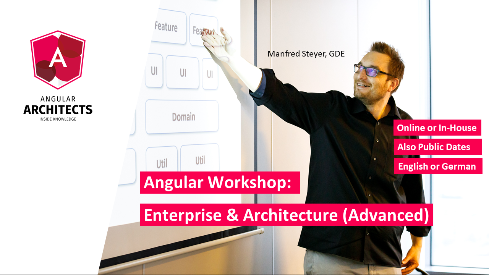

# Einleitung

In den letzten Jahren habe ich zahlreiche Unternehmen mit der Umsetzung von Unternehmens- und Industrieanwendungen mit Angular geholfen. Sowohl mit der Einführung als auch mit weiterführenden Konzepten. Mit diesem Buch möchte ich auch Ihnen zeigen, wie Sie Angular für Ihre Projekte nutzen können.

Dazu erstellen wir gemeinsam im Laufe der Kapitel eine vollständige Angular-Anwendung und verfeinern sie nach und nach. Der Fokus liegt sowohl auf der konkreten Umsetzung als auch auf der Schaffung eines guten Verständnisses für die dahinterliegende Konzepte. Alle Aspekte, die Sie für eine erste Angular-Anwendung benötigen werden dabei besprochen. 

Wenn Sie Fragen oder Feedback haben, erreichen Sie bitte [manfred.steyer@angulararchitects.io](mailto:manfred.steyer@angulararchitects.io). 

Außerdem finden Sie mich auch auf [Twitter](https://twitter.com/manfredsteyer) und [Facebook](https://www.facebook.com/manfred.steyer). Lassen Sie uns in Kontakt bleiben, um aktuelle Updates rund um Angular zu erhalten.

## Trainings and Consultancy

Wenn Sie und Ihr Team Unterstützung oder Schulungen in Bezug auf Angular benötigen, helfen wir Ihnen gerne mit unseren Workshops und Beratungen -- sowohl **vor Ort** als auch per **Remote**. Wir bieten unter anderem Workshops für folgende Themen an:

- Angular Workshop: Strukturierte Einführung (3 Tage)
- Advanced Angular: Enterprise Solutions and Architecture (3 Tage)
- Angular Architecture Consulting
- Professional Angular Testing Workshop mit Cypress, Jest, etc. (3 Tage)
- Angular: Reactive Architekturen mit RxJS and NGRX (2 Tage)
- Angular Review Consulting Workshop
- Angular Upgrade Consulting Workshop

Sie finden hier [unser volles Workshop-Angebot](https://www.angulararchitects.io/en/angular-workshops/).

Wir bieten unsere Workshop in verschiedenen Formen an: **Online**, **Öffentlich** oder als **Unternehmens-Workshop** sowohl in **Englisch** als auch in **Deutsch**.

Wenn Sie Fragen haben, können Sie gerne auf uns zukommen: [office@softwarararchitekt.at](mailto:office@softwarararchitekt.at).
