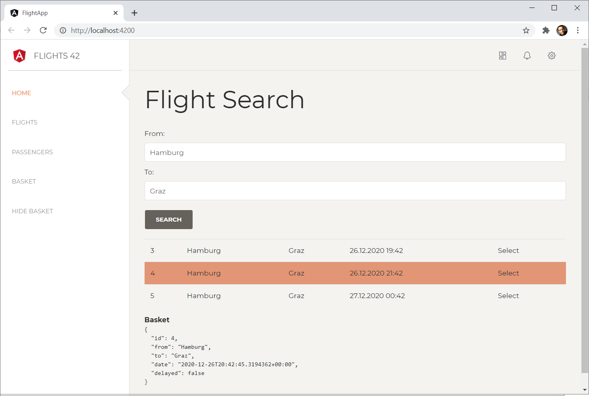
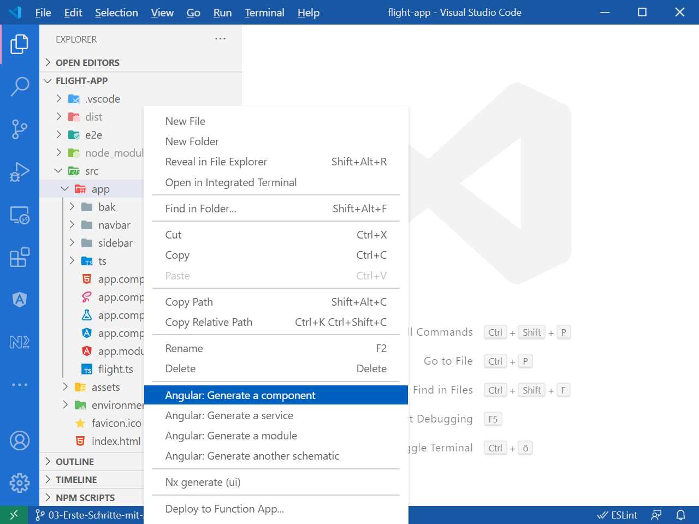
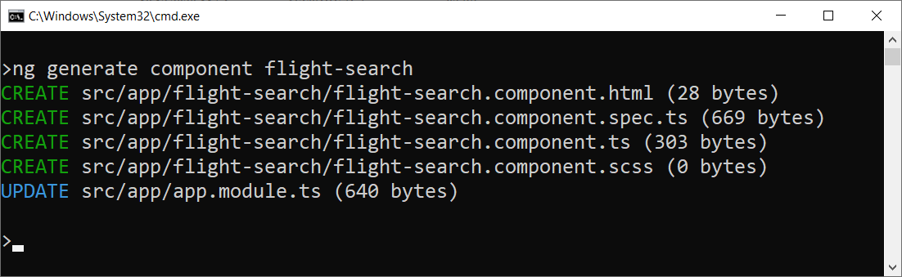
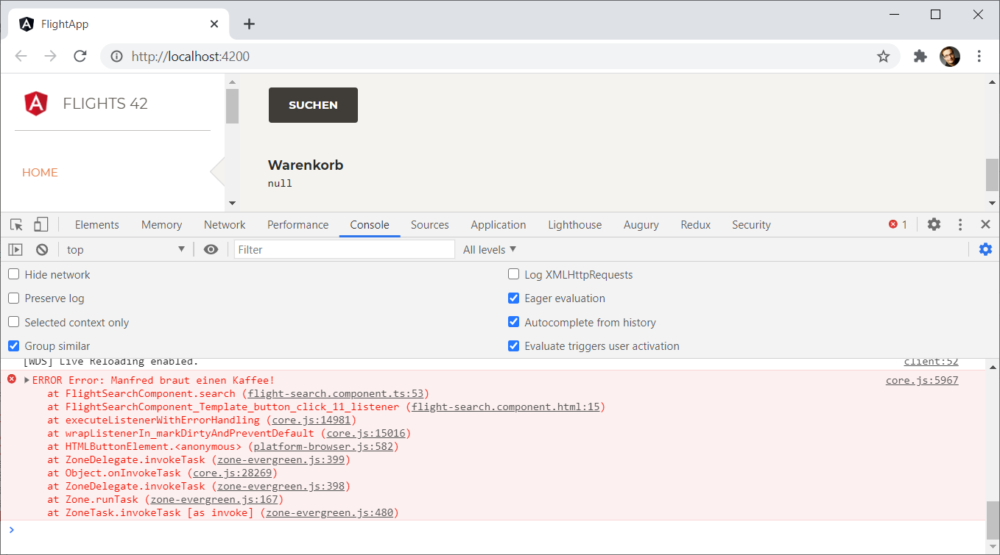
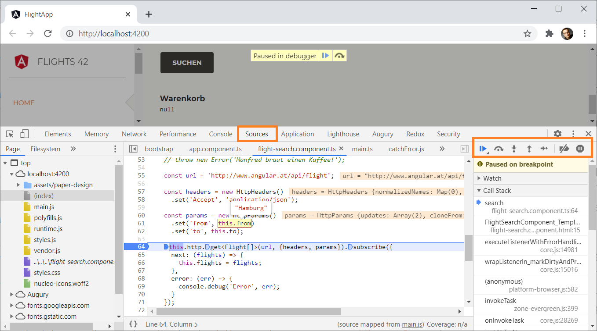
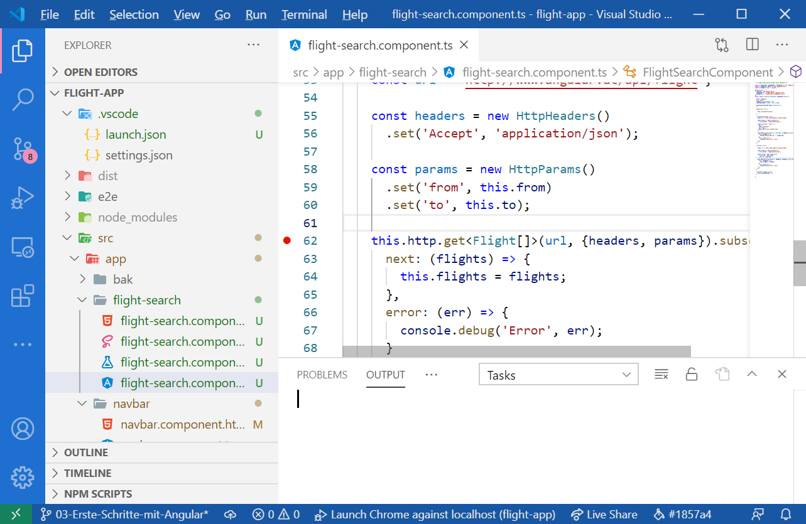
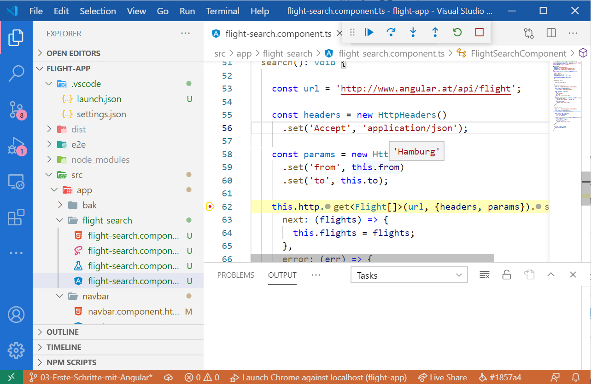

# Ihr erste Angular-Anwendung: Komponenten, Datenbindung und HTTP-Zugriff

Um Ihnen die einzelnen Aspekte von Angular zu vermitteln, verwenden wir
in diesem Buch ein durchgängiges Beispiel. Sie können es in unserem [GitHub-Account](https://github.com/manfredsteyer/angular-intr) finden. Dabei handelt es sich um eine Anwendung zum Buchen von Flügen. Wir setzen dazu auf die im letzten Kapitel generierte Anwendung auf:



## Interface für Datenobjekt erzeugen

Da wir mit Flügen arbeiten wollen, brauchen wir einen Datentyp der die Struktur der Flug-Objekte widerspiegelt. Hierzu legen wir zunächst im Ordner ``src/app`` eine Datei ``flight.ts`` mit dem folgenden Interface an:

```typescript
// src/app/flight.ts
export interface Flight { 
    id: number; 
    from: string; 
    to: string; 
    date: string; 
    delayed?: boolean;
}
```

## Angular-Komponente erzeugen 

Nun erstellen wir eine Angular-Komponente für den besprochenen Anwendungsfall erstellen. Wechseln Sie dazu auf die Konsole. Führen Sie im Hauptverzeichnis der Anwendung (Verzeichnis mit der ``angular.json``) den folgenden Befehl aus:

```bash
ng generate component flight-search
```

> Die Befehle der CLI lassen sich abkürzen, die betrachtete Anweisung könnte man beispielsweise auch wie folgt formulieren:
>
> ```bash
> ng g c flight-search
> ```
> 
> Mit dem in Kapitel 1 erwähnten Visual Studio Plug-in *Angular Schematics* Angular Schematics lässt sich dieser CLI-Befehl auch direkt über Visual Studio Code anstoßen. Wählen Sie dazu die Anweisung *Angular: Generate a component* aus dem Kontextmenü des gewünschten Ordners.
>
> 
>
> Nach dem Auswählen dieser Anweisung stellt Ihnen Visual Studio Code mehrere Fragen. Die Frage nach dem Komponentennamen beantworten Sie analog zum oben diskutierten Befehl mit `flight-search`. Die anderen Fragen können Sie einfach mit *Enter* quittieren, um mit den Standardeinstellungen der CLI vorlieb zu nehmen.

Die Angular CLI generiert daraufhin mehrere Dateien für die gewünschte Komponente:



Diese Dateien richtet die CLI im Ordner ``src/app/flight-search`` ein:

- **flight-search.component.html**: Das Template der Komponente. Es bestimmt, wie Angular die Komponente darstellt.

- **flight-search.component.ts**: Die TypeScript-Klasse, die die Komponente repräsentiert. Sie definiert das gewünschte Verhalten.

- **flight-search.component.scss**: Die Stylesheet-Datei mit lokalen Styles für unsere Komponente.

Die Dateien flight-search.component.ts* und *flight-search.component.html* werden wir in den nachfolgenden Abschnitten näher betrachten und für unsere Zwecke anpassen.

## Komponentenlogik

Die generierte Datei ``flight-search.component.ts`` beinhaltet das Grundgerüst für unsere Komponentenlogik:

```typescript
// src/app/flight-search/flight-search.component.ts
import { Component, OnInit } from '@angular/core';

@Component({
    selector: 'app-flight-search',
    templateUrl: './flight-search.component.html',
    styleUrls: ['./flight-search.component.scss']
})
export class FlightSearchComponent implements OnInit {

    constructor() { }

    ngOnInit(): void {
    }

}
```

Viele der hier generierten Konstrukte haben wir bereits in Kapitel 1 im Rahmen der `AppComponent` besprochen. Allerdings möchten wir hier Ihre Aufmerksamkeit auf ein paar Details lenken:

- Der Selektor lautet `app-flight-search`. Das Präfix `app` wurde von der CLI eingefügt. Diese Präfixe sollen Namenskonflikte mit Komponenten aus Bibliotheken verhindern.

- Die generierte Klasse nennt sich `FlightSearchComponent`, während die zugrunde liegende Datei den Namen ``flight-search.component.ts`` erhalten hat. Hierbei handelt es sich um die üblichen Namenskonventionen in der Welt von Angular.

- `FlightSearchComponent` implementiert das Interface `OnInit`, das wiederum die Methode `ngOnInit` vorgibt. Diese Methode ruft Angular nach dem Initialisieren der Komponente auf, und somit kann sie für Initialisierungen von Eigenschaften verwendet werden.

Lassen Sie uns nun dieses Grundgerüst ein wenig ausbauen, um eine Suche nach Flügen zu ermöglichen:

```typescript
// src/app/flight-search/flight-search.component.ts

import { Component, OnInit } from '@angular/core';
import { Flight } from '../flight';

@Component({
    selector: 'app-flight-search',
    templateUrl: './flight-search.component.html',
    styleUrls: ['./flight-search.component.scss']
})
export class FlightSearchComponent implements OnInit {

    from = 'Hamburg';
    to = 'Graz';
    flights: Array<Flight> = [];
    selectedFlight: Flight | null = null;

    constructor() {
    }

    ngOnInit(): void {
    }

    search(): void {
      // Implementierung folgt weiter unten.
    }

    select(f: Flight): void {
        this.selectedFlight = f;
    }

}
```

Die Eigenschaften `from` und `to` repräsentieren die Suchkriterien für die gewünschten Flüge. Die Standardwerte sollen hier verhindern, dass wir später immer wieder die gleichen Suchkriterien eingeben müssen. Außerdem lassen sie uns auf den ersten Blick erkennen, ob der weiter unten angestrebte automatische Abgleich zwischen den Eigenschaften und den Textfeldern funktioniert.

Das Array `flights` nimmt die gefundenen Flüge auf. Es ist mit dem zu erzeugten Interface `Flight` typisiert.

Die Eigenschaft `selectedFlight` repräsentiert den ausgewählten Flug. Damit sie initial den Wert null bekommen kann, ist sie vom Typ `Flight | null`.

> Angular verwendet standardmäßig TypeScript im Strict Mode. Das bedeutet unter anderem, dass Sie explizit angeben müssen, ob Eigenschaften den Wert ``null`` bzw. ``undefined`` aufnehmen dürfen. In diesen Fällen zwingt Sie TypeScript auch dazu, vor der Verwendung gegen diese Werte zu prüfen.

Die Methode `search` kümmert sich um das Abrufen der Flüge. Wir werden uns um ihre Implementierung gleich kümmern. Die Methode  `select` notiert sich den vom Benutzer ausgewählten Flug.


## Auf das Backend zugreifen

Für Ihre Hauptaufgabe muss die `FlightSearchComponent` via HTTP auf eine Web-API mit Flügen zugreifen. Für solche Vorhaben bietet Angular die Klasse `HttpClient`. Da diese Klasse wiederverwendbare Dienste anbietet, ist auch von einem Service die Rede.

Um Zugriff auf den Service zu bekommen, müssen Sie zunächst das
`HttpClientModule` in Ihr `AppModule` importieren:

```typescript
// src/app/app.module.ts

[...]
// Diese Zeile einfügen:
import { HttpClientModule } from '@angular/common/http';

@NgModule({
    imports: [
        //Diese Zeile unter *imports* einfügen:
        HttpClientModule,
        BrowserModule
    ],
    declarations: [
        [...]
    ],
    providers: [],
    bootstrap: [
        AppComponent
    ]
})
export class AppModule { }
```

Danach können Sie über den Konstruktor der `FlightSearchComponent` eine
Instanz von `HttpClient` anfordern:

```typescript
// src/app/flight-search/flight-search.component.ts

import { HttpClient } from '@angular/common/http';
import { Component, OnInit } from '@angular/core';
import { Flight } from '../flight';

@Component({
    selector: 'app-flight-search',
    templateUrl: './flight-search.component.html',
    styleUrls: ['./flight-search.component.scss']
})
export class FlightSearchComponent implements OnInit {

    from = 'Hamburg';
    to = 'Graz';
    flights: Array<Flight> = [];
    selectedFlight: Flight | null = null;

    // HttpClient anfordern:
    constructor(private http: HttpClient) {
    }

    [...]

}
```

Diese Vorgehensweise nennt sich auch *Dependency Injection* Dependency Injection bzw. *Constructor Injection*: Die benötigte Serviceinstanz wird demnach von Angular in den Konstruktor injiziert. Das bedeutet, dass Angular entscheidet, welche konkrete Ausprägung des `HttpClient` die Komponente erhält. Während Angular für den Produktionsbetrieb den "richtigen" `HttpClient` erzeugt, könnte es für automatisierte Tests eine Dummy-Implementierung verwenden, die HTTP-Zugriffe lediglich simuliert.

Da wir nun unsere `HttpClient`-Instanz haben, können wir damit innerhalb von `search` auf die Web-API zugreifen:

```typescript
// src/app/flight-search/flight-search.component.ts

// Wir benötigen diese drei Importe für den HttpClient:
import { HttpClient, HttpHeaders, HttpParams } from '@angular/common/http';

import { Component, OnInit } from '@angular/core';
import { Flight } from '../flight';

@Component({
    selector: 'app-flight-search',
    templateUrl: './flight-search.component.html',
    styleUrls: ['./flight-search.component.scss']
})
export class FlightSearchComponent implements OnInit {

    from = 'Hamburg';
    to = 'Graz';
    flights: Array<Flight> = [];
    selectedFlight: Flight | null = null;

    constructor(private http: HttpClient) {
    }

    ngOnInit(): void {
    }

    search(): void {

        const url = 'http://demo.ANGULARarchitects.io/api/flight';

        const headers = new HttpHeaders()
            .set('Accept', 'application/json');

        const params = new HttpParams()
            .set('from', this.from)
            .set('to', this.to);

        this.http.get<Flight[]>(url, {headers, params}).subscribe({
            next: (flights) => {
                this.flights = flights;
            },
            error: (err) => {
                console.error('Error', err);
            }
        });
    }

    select(f: Flight): void {
        this.selectedFlight = f;
    }

}
```

Die Methode `search` ruft nun bei einer von uns bereitgestellten Web API ("Rest API") Flüge ab und hinterlegt sie in der Eigenschaft `flights`:

- Die zu nutzenden HTTP-Kopfzeilen Kopfzeile HTTP-Kopfzeile stellt der `HttpClient` mit einer Instanz von `HttpHeaders` dar. Das Beispiel übergibt die Kopfzeile `Accept`, um anzugeben, dass wir JSON als Antwortformat wünschen. Dabei handelt es sich um das einzige Datenformat, das Angular ab Werk unterstützt.

- Die zu übersendenden URL-Parameter URL-Parameter repräsentiert der `HttpClient` mit einer `HttpParams`-Auflistung.

- Bitte beachten Sie, dass die beiden Aufrufe von `set` die aktuelle Auflistung *nicht verändern*, sondern eine neue Auflistung zurückliefern. Deswegen verkettet das Beispiel auch die einzelnen Aufrufe von `set`.

- Die Methode `get` führt einen HTTP-Zugriff unter Verwendung der HTTP-Methode `GET` durch. Diese Methode kommt typischerweise zum Abrufen von Daten zum Einsatz.

- Als Ergebnis des HTTP-Aufrufs erwartet der `HttpClient` ein JSON-Dokument, das er in ein JavaScript-Objekt umwandelt. Den Datentyp dieses Objekts nimmt `get` als Typparameter entgegen

- Das Abrufen von Daten erfolgt im Browser asynchron, also im Hintergrund. Sobald die Daten vorliegen, bringt der `HttpClient` eine der beiden bei `subscribe` registrierten Methoden zur Ausführung: `next` im Erfolgsfall und `error` in Fehlerfall. Das Objekt, das die Methode `subscribe` anbietet, ist übrigens ein sogenanntes *Observable*.

- Neben der hier verwendeten Methode `get` bietet der `HttpClient` noch weitere Methoden für andere Arten von HTTP-Zugriffen.

|Methode|Semantik|
|--- |--- |
|get<T>(url, options)|Abrufen von Ressourcen.|
|post<T>(url, body, options)|Hinzufügen einer Ressource oder Anstoßen einer Verarbeitung am Server.|
|put<T>(url, body, options)|Hinzufügen oder Aktualisieren einer Ressource.|
|patch<T>(url, body, options)|Aktualisieren einer Ressource. Es müssen nur die geänderten Eigenschaften übergeben werden.|
|delete<T>(url, options)|Löschen einer Ressource.|

Der Begriff *Ressource* kommt aus der Welt von HTTP und bezeichnet das abgerufene oder zu sendende Objekt bzw. Dokument. Der Typparameter `T` steht für den Datentyp der Antwort. Im oben betrachteten Beispiel war das `Flight[]`. Jene Methoden, die Daten zum Server senden, weisen einen Parameter `body` auf. Dieser nimmt das zu sendende Objekt entgegen. Für die Übertragung per HTTP wandelt der `HttpClient` es in ein JSON-Objekt um. Der Parameter `options` erhält ein Objekt, das die HTTP-Anfrage näher beschreibt. Im oben gezeigten Beispiel verweist es auf die zu sendenden Kopfzeilen sowie auf die zu verwendenden URL-Parameter.

Bitte beachten Sie auch, dass nicht jede Web-API alle hier beschriebenen Methoden unterstützt. 

Zur Veranschaulichung erzeugt die folgende Methode einen neuen Flug.

```typescript
createDemoFlight(): void {
    const url = 'http://demo.ANGULARarchitects.io/api/flight';

    const headers = new HttpHeaders().set('Accept', 'application/json');

    const newFlight: Flight = {
        id: 0,
        from: 'Gleisdorf',
        to: 'Graz',
        date: new Date().toISOString()
    };

    this.http.post<Flight>(url, newFlight, { headers }).subscribe({
        next: (flight) => {
            console.debug('Neue Id: ', flight.id);
        },
        error: (err) => {
            console.error('Error', err);
        }
    });
}
```

Das Beispiel geht davon aus, dass der erzeugte Flug samt der serverseitig vergebenen ID wieder zurückgeliefert wird.

Falls Sie diese Methode ausprobieren möchten, können Sie sie im Konstruktor der Komponente aufrufen (`this.createDemoFlight()`).

## Templates und die Datenbindung

Nachdem wir nun die Logik unserer Komponente in der Klasse `FlightSearchComponent` verstaut haben, können wir uns ihrem Template zuwenden. Es handelt sich dabei um die Datei ``flight-search.component.html``.

Auf den ersten Blick handelt es sich hier um eine normale HTML-Datei. Neben HTML-Elementen kann sie jedoch auch sogenannteDatenbindungsausdrücke beinhalten. Damit gleicht Angular den Zustand der Komponente mit dem Zustand des Templates ab. Angular schreibt dazu beispielsweise Daten aus der Komponente in das Template oder übernimmt Eingaben in entsprechende Komponenteneigenschaften.

Eine erste Art von Datenbindungsausdruck haben Sie in Kapitel 1 im Rahmen der `AppComponent` bereits kennengelernt: Der Ausdruck

```html
<h1>{{title}}</h1>
```

hat dort den Inhalt der Eigenschaft `title` ausgegeben.

Hier wollen wir nun auf weitere Arten der Datenbindung eingehen.

### Two-Way-Binding

Beim Einsatz von Formularen gilt es häufig, Eigenschaften aus der Komponente mit Eingabefeldern in der Anwendung abzugleichen: Die Werte der Eigenschaften sind also in Formularfelder zu übernehmen. Ändert der Anwender diese Felder, sind die neuen Werte in die jeweiligen Eigenschaften zurückzuschreiben. Diese Aufgabe übernimmt Angular mit sogenannten Two-Way-Bindings.

Wenn Sie mit einem Two-Way-Binding beispielsweise die Eigenschaft `from` aus unserer `FlightSearchComponent` an ein Eingabefeld binden wollen, müssen Sie in Angular folgende Schreibweise nutzen:

```html
<input [(ngModel)]="from" name="from">
```

> Kommt `input` innerhalb eines `form`-Elements zum Einsatz, muss es auch ein `name`-Attribut aufweisen. Angular nutzt diesen Wert zum Aufbau interner Datenstrukturen.

Damit Sie auf den ersten Blick erkennen, dass es sich hier um ein Two-Way-Binding handelt, nutzt Angular eckige Klammern in Kombination mit runden. Die Community nennt diese Schreibkonvention auch *Banana-in-a-Box*. Zugegeben, dieser Einsatz von Sonderzeichen wirkt zunächst ein wenig seltsam. Allerdings hat sich das Angular-Team ganz bewusst für diese Schreibweise entschieden, um die Art der Datenbindung offensichtlich zu machen.

Bei `ngModel` handelt es sich um eine sogenannte *Direktive*. Direktiven sind von Angular bereitgestellte DOM-Erweiterungen, die Verhalten zur Seite hinzufügen. Im Fall von `ngModel` besteht dieses Verhalten im gewünschten Abgleich mit der angegebenen Eigenschaft. Gewissermaßen ist `ngModel` ein Experte für Eingabefelder: Es weiß, wie es die verschiedenen Eingabefelder – darunter Textfelder, Checkboxen, Radioboxen und Drop-down-Felder – mit den angegebenen Eigenschaften abgleichen kann.

Damit `ngModel` zur Verfügung steht, muss das `FormsModule` in unser
`AppModule` importiert werden:

```typescript
// src/app/app.module.ts

[...]

// Diese Zeile einfügen:
import { FormsModule } from '@angular/forms';

@NgModule({
    imports: [
        // Diesen Eintrag hinzufügen:
        FormsModule,
        [...]
    ],
    declarations: [
        [...]
    ],
    providers: [],
    bootstrap: [
        AppComponent
    ]
})
export class AppModule { }
```

> Two-Way-Data-Binding funktioniert nur mit ausgewählten Eigenschaften. Unter diesen ist `ngModel` die einzige, die Angular ab Werk zur Verfügung steht. Sie können jedoch eigene Eigenschaften, die Two-Way-Data-Binding unterstützen, entwickeln. Details dazu finden Sie im nächsten Kapitel.

### Property-Bindings

Ähnlich wie Two-Way-Bindings übernehmen Property-Bindings Eigenschaften aus der Komponente in das Markup. Auch nach dem Aktualisieren der Eigenschaften in der Komponente aktualisiert diese Binding-Art die Ausgabe. Allerdings schreibt sie Änderungen des Benutzers nicht mehr in die Komponente zurück. Deswegen könnte man hier auch von One-Way-Bindings sprechen.

Um solch ein Binding einzurichten, nutzen Sie eckige Klammern:

```html
<button [disabled]="!from || !to">Search</button>
```

Das hier betrachtete Beispiel bindet den Ausdruck `!from || !to` an die DOM-Eigenschaft `disabled`. Der Ausdruck prüft, ob mindestens eine der beiden Eigenschaften leer ist. Das Beispiel deaktiviert somit die Schaltfläche, wenn keine Werte für diese Eigenschaften vorliegen.

Das Beispiel zeigt auch, dass Angular sich an standardmäßig vorherrschende DOM-Eigenschaften binden kann. Genau genommen, ist es aus Sicht von Angular egal, warum eine DOM-Eigenschaft existiert. Sowohl Standardeigenschaften als auch eigene Eigenschaften wie `ngModel` im letzten Abschnitt sowie DOM-Erweiterungen von anderen Bibliotheken lassen sich zusammen mit der Datenbindung nutzen.

Eine weitere Schreibweise für One-Way-Bindings sieht den bereits diskutierten Einsatz geschweifter Klammern vor:

```html
<div>Es wurden {{ selectedFlight.length }} Flüge gefunden</div>
```

Damit platziert Angular eine Eigenschaft bzw. einen darauf basierenden Ausdruck mitten in der Seite.

### Direktiven

Wie bereits erwähnt, fügen Direktiven der Seite Verhalten hinzu. Dieses kann die Datenbindung unterstützen. Ein Beispiel dafür ist die Direktive `ngFor`, die eine Auflistung iteriert und pro Eintrag ein Stück HTML rendert:

```html
<table class="table table-striped">
    <tr *ngFor="let flight of flights">
    <td>{{flight.id}}</td>
    <td>{{flight.from}}</td>
    <td>{{flight.to}}</td>
    <td>{{flight.date}}</td>
    </tr>
</table>
```

Im hier betrachteten Fall durchläuft `ngFor` sämtliche Flüge des Arrays `flights` aus der Komponente des vorherigen Abschnitts. Pro Flug rendert sie eine Tabellenzeile. Bitte beachten Sie, dass in Anlehnung an die `for-of`-Schleife in ECMAScript auch hier im Rahmen der Datenbindung das Schlüsselwort `of` zu verwenden ist.

Der vorangestellte Stern (`*ngFor`) gibt darüber Auskunft, dass es sich beim Inhalt des aktuellen Elements um ein sogenanntes Template handelt. Damit sind hier HTML-Fragmente gemeint, die Angular zunächst gar nicht rendert und bei Bedarf einmal oder mehrere Male in die Seite einfügt.


```html
<table class="table table-striped">
    <tr *ngFor="let flight of flights"
        [ngClass]="{ 'active': flight === selectedFlight }">

    [...]

    </tr>
</table>
```

Somit erhält die Tabellenzeile mit dem gerade ausgewählten Flug die Klasse `active`. Dieser Style kann in der Datei ``flight-search.component.scss`` definiert werden:

```css
.active {
    background-color:darkorange
}
```

In diesem Fall gilt der Style nur für die `FlightSearchComponent`. Um ihn global zur Verfügung zu stellen, ist er in die Datei ``src/styles.scss`` einzutragen.

### Pipes

Ähnlich wie Direktiven unterstützen auch Pipes die Datenbindung. Sie
sind in der Lage, Werte beim Binden zu verändern, und lassen sich somit
unter anderem für das Formatieren von Werten nutzen. Zur Demonstration
nutzt das folgende Beispiel die von Angular angebotene Pipe `date` zum
Formatieren des Datums:

```html
<td>{{flight.date | date:'dd.MM.yyyy HH:mm'}}</td>
```

Eine weitere standardmäßig vorhandene Pipe, die vor allem Entwicklern
hilft, ist die Pipe `json`. Sie wandelt das gesamte Objekt in seine
JSON-Repräsentation um. Somit können Entwickler Objekte zum Testen
ausgeben, ohne dafür eine Komponente oder Markup schreiben zu müssen:

```html
<b>Basket</b>
<pre>{{ selectedFlight | json }}</pre>
```

### Event-Bindings 

Runde Klammern führen zu einer Bindung an Events. Dabei kann es sich sowohl um DOM-Events als auch um Erweiterungen von Frameworks wie Angular handeln. Das hier betrachtete Beispiel nutzt zwei Event-Bindings, um auf Mausklicks zu reagieren. Das eine Event-Binding verknüpft die Schaltfläche *Search* mit der Komponentenmethode `search`:

```html
<button (click)="search()" [disabled]="!from || !to">
Search
</button>
```

Das andere Event-Binding ruft für einen der dargestellten Flüge die Methode `select` auf, um ihn als ausgewählten Flug vorzumerken:

```html
<table class="table table-striped">
    <tr *ngFor="let flight of flights" 
        [ngClass]="{ 'active': flight === selectedFlight }">
    […]
    <td><a (click)="select(flight)">Select</a></td>
    </tr>
</table>
```

> Verwenden Sie das folgende Styling in der Datei ``src/styles.scss``, damit der Browser auch für Anchor-Tags ohne `href`-Attribut den typischen Mauscursor für klickbare Links (Zeigefingersymbol) anzeigt:
> ```
>a {
>    cursor: pointer;
>}
>```

### Das gesamte Template Template

Der Vollständigkeit halber platzieren wir hier nochmal das gesamte
Template für die `FlightSearchComponent`, das wir in den vorangegangenen
Abschnitten besprochen haben:

```html
<!-- src/app/flight-search/flight-search.component.html -->

<h1>Flight Search</h1>

<div class="form-group">
    <label>From:</label>
    <input [(ngModel)]="from" class="form-control">
</div>
<div class="form-group">
    <label>To:</label>
    <input [(ngModel)]="to" class="form-control">
</div>

<div class="form-group">
    <button class="btn btn-default" (click)="search()" [disabled]="!from || !to">
        Search
    </button>
</div>

<table class="table table-striped">

    <tr *ngFor="let flight of flights" 
        [ngClass]="{ 'active': flight === selectedFlight }">
        <td>{{flight.id}}</td>
        <td>{{flight.from}}</td>
        <td>{{flight.to}}</td>
        <td>{{flight.date | date:'dd.MM.yyyy HH:mm'}}</td>
        <td><a (click)="select(flight)">Select</a></td>
    </tr>

</table>

<b>Basket</b>
<pre>{{ selectedFlight | json }}</pre>
```

Dabei fällt auf, dass die verwendeten Sonderzeichen, die bei ersten Schritten mit Angular durchaus gewöhnungsbedürftig sind, uns beim Erkennen der gewählten Datenbindungsart unterstützen und das Template somit nachvollziehbarer gestalten.

## Komponenten einbinden

Nachdem wir nun eine erste eigene Komponente geschaffen haben, müssen wir sie nur noch in unsere Anwendung einbinden. Damit die Angular-Anwendung unsere Komponente überhaupt berücksichtigen kann, muss sie in einem Angular-Modul deklariert werden. In unserem Fall handelt es sich dabei um das `AppModule`.

Diese Aufgabe sollte die CLI beim Generieren der Komponente schon übernommen haben. Aber zur Sicherheit lohnt es sich, das zu überprüfen. Öffnen Sie dazu die Datei *app.module.ts* und vergewissern Sie sich, dass die `FlightSearchComponent` unter `declarations` eingetragen ist:

```typescript
// src/app/app.module.ts

[...]
import { AppComponent } from './app.component';
[...]

@NgModule({
    imports: [
        FormsModule,
        HttpClientModule,
        BrowserModule
    ],
    declarations: [
        AppComponent,
        SidebarComponent,
        NavbarComponent,

        // Unsere Komponente:
        FlightSearchComponent
    ],
    providers: [],
    bootstrap: [
        AppComponent
    ]
})
export class AppModule { }
```

Danach können wir die Komponente im Template der `AppComponent` aufrufen:

```html
<div class="wrapper">

    <div class="sidebar" data-color="white" data-active-color="danger">
        <app-sidebar-cmp></app-sidebar-cmp>
    </div>

    <div class="main-panel">
        <app-navbar-cmp></app-navbar-cmp>

        <div class="content">

            <!-- Alt: -->
            <!-- <h1>{{title}}</h1> -->

            <!-- Diese Zeile einfügen: -->
            <app-flight-search></app-flight-search>

        </div>
    </div>

</div>
```    

## Anwendung starten

Gratulation! Sie haben Ihre erste Angular-Anwendung geschrieben, und es ist nun an der Zeit, sie auszuführen.

Zum Starten Ihrer Anwendung nutzen Sie die Angular CLI im Projekthauptverzeichnis:

```bash
ng serve -o
```

Nach dem Start des Entwicklungswebservers steht die Anwendung unter <http://localhost:4200> bereit:


## Fehler in der Entwicklerkonsole entdecken

Verhält sich die Anwendung nicht wie gewünscht, sollten Sie einen Blick
auf die Konsole in den Entwicklerwerkzeugen (*F12* oder
*Strg+Umschalt+I*) werfen. Hier finden Sie häufig Fehlermeldungen:



Der gezeigte Fehler wurde zur Veranschaulichung mit der Anweisung

    throw new Error('Manfred braucht einen Kaffee!');

am Anfang der Methode `search` provoziert. In der Regel ist das jedoch nicht notwendig: Anwendungen weisen häufig auch ohne weiteres Zutun Bugs auf ;-).

Bitte beachten Sie die Hyperlinks, die Angular im Rahmen der Fehlermeldung ausgibt. Diese führen zu Zeilen in den betroffenen HTML-und TypeScript-Dateien, die beim Auftreten des Fehlers durchlaufen wurden.

### Bonus: Die Anwendung im Browser debuggen

In Fällen, in denen Sie die Ursache des Fehlers nicht finden, können Sie auch den in den Browser integrierten JavaScript-Debugger einsetzen. Die Voraussetzung dafür ist, dass die CLI Metadaten für den Debugger – sogenannte *Source-Maps* – generiert hat. Beim Einsatz von `ng serve` ist das standardmäßig der Fall.

Bei Chrome finden Sie den Debugger in den Entwicklerwerkzeugen auf dem Registerblatt *Sources*:



Hier können Sie Ihre Programmdateien öffnen und durch einen Klick auf eine Zeilennummer auf der linken Seite einen Break Point definieren. Zum Öffnen Ihrer Programmdateien empfiehlt sich die Tastenkombination *Strg+Umschalt+P*. Diese öffnet einen Dialog, mit dem Sie nach der gewünschten Datei suchen können. Geben Sie dazu einfach die ersten Buchstaben des Dateinamens ein.

Gelangt die Programmausführung zur Zeile mit dem Break Point, wird die Anwendung angehalten. Danach können Sie mit den Schaltflächen links oben die Ausführung Schritt für Schritt fortsetzen und z. B. die aktuellen Werte Ihrer Variablen und Eigenschaften einsehen.

### Bonus: Debuggen mit Visual Studio Code

Etwas komfortabler lässt sich der in Chrome integrierte Debugger über Visual Studio Code bedienen. Damit das möglich ist, müssen Sie das Visual-Studio-Code-Plug-in *Debugger for Chrome* installiert haben.

Zum Starten des Debuggers via Visual Studio Code benötigen Sie die Datei *.vscode/launch.json*. Falls sie noch nicht existiert, können Sie sie mit den folgenden Schritten einrichten:

1.  Öffnen Sie eine beliebige ``.ts``-Datei.

2.  Wählen Sie in Visual Studio Code den Befehl ``Run/Start Debugging``
    oder drücken Sie ``F5``.

3.  Falls Visual Studio Code Sie nach einer Umgebung (Environment) für
    das Debugging fragt, wählen Sie *Chrome* aus.

4.  Visual Studio Code generiert nun eine Datei ``launch.json`` und zeigt
    diese an.

5.  Korrigieren Sie in der Datei ``launch.json`` die angezeigte URL auf
    ``http://localhost:4200``:

    ```json
    {
        "version": "0.2.0",
        "configurations": [
            {
                "type": "chrome",
                "request": "launch",
                "name": "Launch Chrome against localhost",
                "url": "http://localhost:4200",
                "webRoot": "${workspaceFolder}"
            }
        ]
    }
    ```

Wenn alle Stricke reißen, können Sie diese Datei auch manuell anlegen.

Um den Debugger nun via Visual Studio Code zu nutzen, sind die folgenden Schritte notwendig:

1.  Starten Sie Ihre Anwendung wie gewohnt mit `ng serve`.

2.  Erzeugen Sie direkt in Visual Studio Code durch einen Klick links neben eine Zeilennummer einen Break Point:

    

3.  Wählen Sie den Befehl ``Run/Start Debugging`` oder drücken Sie ``F5``.

4.  Nun öffnet sich Chrome.

5.  Sobald der Programmfluss auf den Break Point stößt, hält der Debugger die Anwendung an.

6.  Sie können den Debugger jetzt direkt aus Visual Studio Code heraus steuern, die Ausführung Schritt für Schritt fortsetzen und die Werte von Variablen bzw. Eigenschaften einsehen. 

    

## Zusammenfassung

Angular-Anwendungen bestehen aus Komponenten. Hierbei handelt es sich um
Klassen, die Informationen über Eigenschaften sowie das gewünschte
Verhalten über Methoden anbieten. Dazugehörige Templates definieren, wie
Angular die Komponenten darstellt. Mit Datenbindungsausdrücken stellen
sie die Eigenschaften dar und verknüpfen Methoden mit UI-Ereignissen.
