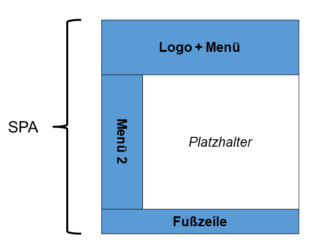
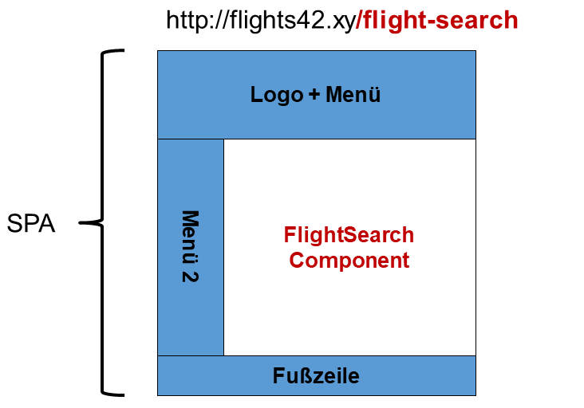
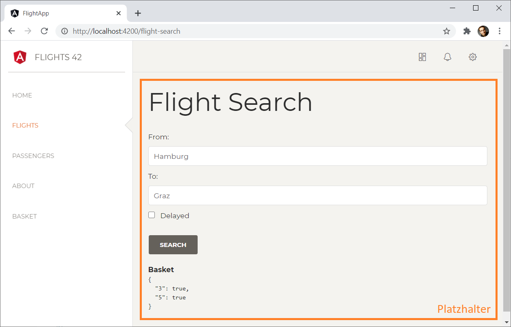
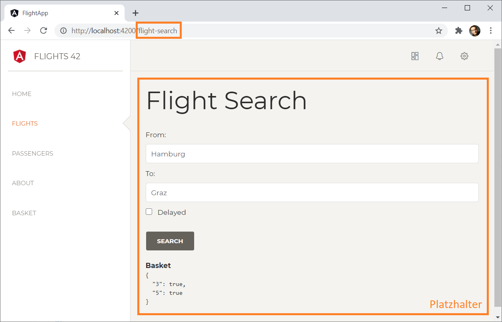

# Navigationsstrukturen schaffen: Der Angular Router

Eine *Single Page Application* (SPA) besteht, wie der Name schon ausdrückt, aus nur einer Seite. Um verschiedene Anwendungsfälle anbieten zu können, müssen wir verschiedene Seiten simulieren. Das erfolgt durch das Ein- und Ausblenden von Komponenten. Der Angular-Router hilft bei dieser Aufgabe.

Dieses Kapitel ergänzt unser Beispiel, sodass es unter Nutzung des Angular-Routers mehrere Ansichten präsentiert. Diese sogenannten Routen lassen sich über einzelne Menüeinträge einblenden.

## Überblick

Wenn eine SPA mehrere Seiten simulieren soll, reicht es nicht, einfach nur Komponenten ein- und auszublenden. Damit der Back-Button so funktioniert, muss sich der durchgeführte Zustandswechsel in der URL widerspiegeln. Dasselbe gilt für Bookmarks oder Links, die auf eine bestimmte Ansicht der SPA verweisen. Glücklicherweise automatisiert der Router auch diese Aufgabe, die man ebenfalls als *Deep Linking* Deep Linking bezeichnet: Er spendiert jeder Route eine eigene URL.

Der Router, der im Lieferumfang von Angular enthalten ist, sieht vor, dass die SPA neben konkreten Bereichen, wie Menüs oder Fußzeilen, auch einen Platzhalter aufweist:

{width=50%}


Um festzulegen, welche Komponente der Router in diesem Platzhalter positionieren soll, hängt der Aufrufer einen zusätzlichen Pfad an die URL an. Dieser Pfad verweist auf einen Konfigurationseintrag, der unter anderem die Komponente bekannt gibt. Man sagt auch, dass der Router die adressierte Komponente aktiviert:

{width=66%}


Hier wurde an die URL der SPA der Pfad */flug-suchen* angehängt. Das veranlasst den Router, die damit assoziierte `FlightSearchComponent` zu aktivieren.

## Komponenten für das Routing einrichten

Um die Funktionsweise des Routers zu veranschaulichen, werden wir endlich die Menübefehle auf der linken Seite an unsere Bedürfnisse anpassen und mit Leben erfüllen:



Der Platzhalter befindet sich in dieser Anwendung rechts vom Seitenmenü. Er soll abhängig vom Anwendungszustand eine der folgenden Komponenten anzeigen:

- `HomeComponent`: Zeigt eine Begrüßung an.

- `FlightSearchComponent`: Unsere Komponente zum Suchen nach Flügen.

- `PassengerSearchComponent`: Komponente zum Suchen nach Passagieren. Vorerst handelt es sich dabei lediglich um eine Dummy-Komponente, die als weiteres Routing-Ziel fungiert.

- `FlightEditComponent`: Komponente zum Editieren von Flügen. Auch hierbei handelt es sich um eine Dummy-Komponente, die als weiteres Routing-Ziel zum Einsatz kommt. Anders als bei der ``PassengerSearchComponent`` nehmen wir hier allerdings einen Routing-Parameter entgegen. 

- `AboutComponent`: Zeigt allgemeine Informationen zur Anwendung.

- `NotFoundComponent`: Wird angezeigt, wenn die gewünschte Route nicht gefunden wurde.


Diese – bis auf die `FlightSearchComponent` – neuen Komponenten können Sie wie gewohnt mit der Angular CLI erzeugen:

```bash
ng generate component home
ng generate component passenger-search
ng generate component flight-edit
ng generate component about
ng generate component not-found
```

Bitte beachten Sie, dass die zweite Anweisung die `PassengerSearchComponent` im Ordner *flight-booking* erzeugt. Darin befindet sich unser `FlightBookingModule`, bei dem die CLI die Komponente auch registriert. Alle anderen Komponenten erzeugt die CLI im Ordner *app* und registriert sie bei der sich dort befindlichen `AppComponent`.

Anstatt die CLI auf der Konsole zu nutzen, können Sie auch auf das bereits besprochene Plug-in *Angular Schematics* in Visual Studio Code zurückgreifen.

> Prüfen Sie zur Sicherheit, ob die Angular CLI die generierten Komponenten erfolgreich beim `AppModule` registriert hat.

Da unsere Benutzer eine ordentliche Begrüßung verdienen, haben wir das Template der `HomeComponent` entsprechend abgeändert:

```html
<!-- src/app/home/home.component.html -->
<h1>Welcome!</h1>
```

## Routing-Konfiguration  einrichten

Damit der Router weiß, wann welche Komponente zu aktivieren ist, stellen
wir ihm im Ordner ``src/app`` die Datei ``app.routes.ts`` mit einer
Routing-Konfiguration für die Komponenten im `AppModule` bereit.

Bei einer RouterKonfiguration Konfiguration Routing-Konfiguration
handelt es sich um eine herkömmliche TypeScript-Datei, die sich direkt
in Visual Studio Code erzeugen lässt (Rechtsklick auf den Ordner
app | New File). Darin befindet sich eine Array-Konstante mit Objekten
vom Typ `Route`, die in erster Linie Pfade auf Komponenten abbilden:

```typescript
// src/app/app.routes.ts

import { Routes } from '@angular/router';
import { HomeComponent } from './home/home.component';
import { FlightSearchComponent } from './flight-search/flight-search.component';
import { PassengerSearchComponent } 
    from './passenger-search/passenger-search.component';
import { FlightEditComponent } from './flight-edit/flight-edit.component';
import { AboutComponent } from './about/about.component';
import { NotFoundComponent } from './not-found/not-found.component';

export const APP_ROUTES: Routes = [
    {
        // Standardroute: Umleitung auf '/home'
        path: '',
        redirectTo: 'home',
        pathMatch: 'full'
    },
    {
        path: 'home',
        component: HomeComponent
    },
    {
        path: 'flight-search',
        component: FlightSearchComponent
    },
    {
        path: 'flight-edit/:id',
        component: FlightEditComponent
    },    
    {
        path: 'passenger-search',
        component: PassengerSearchComponent
    },
    {
        path: 'about',
        component: AboutComponent
    },
    {
        path: '**',
        component: NotFoundComponent
    }
];
```

Etwas Aufmerksamkeit verdient hier die erste Route: Diese weist keinen Pfad auf und fungiert deswegen als Standardroute. Angular aktiviert sie, wenn der Aufrufer keinen Pfad an die URL der SPA anhängt. Ein Beispiel dafür ist <http://localhost:4200>. Mit `redirectTo` leitet die Standardroute auf die darunter definierte `home`-Route weiter.

Eine kleine Herausforderung gibt es jedoch bei solchen Routen: Standardmäßig prüft Angular nur, ob der Pfad in der Konfiguration (z. B. `path: myRoute`) ein Präfix des Pfads in der URL ist (z. B. <http://localhost:4200/myRoute/something-else>). Dummerweise sieht JavaScript einen Leerstring als Präfix aller anderen Strings an. Somit würde der Router die Standardroute mit leerem Pfad immer heranziehen.

Die Lösung für dieses Problem ist die Eigenschaft `pathMatch: full`. In diesem Fall vergleicht Angular den gesamten Pfad aus der Konfiguration mit dem gesamten Pfad in der URL.

Eventuell haben Sie auch die Endung ``:id`` im Pfad der ``FlightEditComponent`` entdeckt. Hierbei handelt es sich um einen Platzhalter mit dem Namen id. Den übergebenen Wert können wir später in der ``FlightEditComponent`` auslesen.

Die Einstellung `path: **` im letzten Eintrag bewirkt, dass sämtliche weiteren Pfade zur `NotFoundComponent` führen. Damit schaffen wir ein letztes Auffangnetz.

Damit Angular diese Konfiguration aufgreift, ist sie gemeinsam mit dem `RouterModule` ins `AppModule` zu importieren:

```typescript
// src/app/app.module.ts

[...]
// Diese beiden Importe einfügen:
import { RouterModule } from '@angular/router';
import { APP_ROUTES } from './app.routes';

@NgModule({
    imports: [
        // Diese Zeilen hinzufügen:
        RouterModule.forRoot(APP_ROUTES),
        [...]
    ],
    declarations: [
        [...]
    ],
    providers: [],
    bootstrap: [
        AppComponent
    ]
})
export class AppModule { }
```

Bitte beachten Sie, dass wir hier die Routing-Konfiguration an `RouterModule.forRoot` übergeben. Da diese Methode systemweite Services einrichtet, darf sie nur im `AppModule` aufgerufen werden. 

## Platzhalter in AppComponent hinterlegen

Anstatt auf eine konkrete Komponente zu verweisen, nutzt die `AppComponent` nun einen Platzhalter. Dieser repräsentiert der Router durch ein `router-outlet`-Element:

```html
<!-- src/app/app.component.html -->

<div class="wrapper">

    <div class="sidebar" data-color="white" data-active-color="danger">
        <app-sidebar-cmp></app-sidebar-cmp>
    </div>

    <div class="main-panel">
        <app-navbar-cmp></app-navbar-cmp>

        <div class="content">

            <!-- Diese Zeile entfernen: -->
            <!-- <app-flight-search></app-flight-search> -->

            <!-- Diese Ziele hinzufügen: -->
            <router-outlet></router-outlet>

        </div>
    </div>

</div>
```

## Hyperlinks zum Aktivieren von Routen nutzen

Nun benötigen wir nur noch Hyperlinks, die die einzelnen Routen im
Platzhalter aktivieren. Dazu passen wir die generierte
`SidebarComponent` an:

```html
<!-- src/app/sidebar/sidebar.component.html -->

[...]

<!-- Diese Einträge um routerLink -->
<!-- und routerLinkActive erweitern: -->
<li routerLinkActive="active">
    <a routerLink="home">
        <p>Home</p>
    </a>
</li>

<li routerLinkActive="active">
    <a routerLink="flight-search" >
        <p>Flights</p>
    </a>
</li>

<li routerLinkActive="active">
    <a routerLink="passenger-search">
        <p>Passengers</p>
    </a>
</li>

<!-- Diesen Eintrag ergänzen: -->
<li routerLinkActive="active">
    <a routerLink="about">
        <p>About</p>
    </a>
</li>
```

Die aus dem `RouterModule` stammende Direktive `routerLink` verweist auf die Pfade der konfigurierten Routen. Die Direktive `routerLinkActive` verweist hingegen auf eine Klasse, mit deren Stylings der aktive Menüpunkt hervorgeben wird. Standardmäßig weist sie die Klasse dem Element zu, wenn das Element einen aktiven `routerLink` aufweist oder dies auf ein Child-Element zutrifft.

Wenn Sie nun Ihre Anwendung starten, sollten die Menüeinträge auf der linken Seite auf die einzelnen Routen verweisen:



Die aktuelle Route wird nun auch durch die URL in der Adresszeile widergespiegelt.

## Routen-Parameter auslesen

Um den für ``flight-edit`` konfigurierten Routing-Parameter auslesen zu können, fordert die `FlightEditComponent` den Service `ActivatedRoute` an:

```typescript
// src/app/flight-booking/flight-edit/flight-edit.component.ts

import { Component, OnInit } from '@angular/core';
import { ActivatedRoute } from '@angular/router';

@Component({
    selector: 'app-flight-edit',
    templateUrl: './flight-edit.component.html',
    styleUrls: ['./flight-edit.component.scss']
})
export class FlightEditComponent implements OnInit {

    id = 0;
    showDetails = false;

    constructor(private route: ActivatedRoute) { }

    ngOnInit(): void {
        this.route.params.subscribe(p => {
            this.id = p.id;
            this.showDetails = p.showDetails;
        });
    }

}
```

Die `ActivatedRoute` bietet neben anderen Eigenschaften, die die gerade aktivierte Route beschreiben, ein Observable `params` an. Dieses veröffentlicht sämtliche Routing-Parameter über ein Objekt, das als Dictionary genutzt wird.

Bei ``id`` handelt es sich um jenen Parameter, den wir in der Routenkonfiguration vorgesehen haben. Den Parameter ``showDetails`` haben wir hingegen nicht konfiguriert. Aus diesem Grund geht Angular davon aus, dass er in Form eines Name/Wert-Paares an den Pfad angehängt wird:

```bash
/flight-edit/17;showDetails=true
```

Im letzteren Fall spricht der URL-Standard auch über Matrix-Parameter. Diese werden durch Strichpunkte getrennt und beziehen sich per Definition auf das letzte Url-Segment und bei Angular somit auf die damit assoziierte Komponente. Der besser bekannte Query-String, der nach einem Fragezeichen an die Url angehängt wird, bezieht sich hingegen per Definition immer auf die gesamte Url.

Das Template der Komponente präsentiert diese Eigenschaften:

```html
<h1>Flight Edit</h1>

<p>
    Id: {{id}}
</p>
<p>
    ShowDetail: {{id}}
</p>
```

An dieser Stelle wollen wir uns mit der bloßen Ausgabe der Parameter zufriedengeben. Allerdings könnte man die Informationen aus den letzten Kapiteln nutzen, um den Flug mit der erhaltenen Id zu laden und über ein Formular zum Editieren anzubieten.

## Auf parametrisierte Routen verweisen

Um auf parametrisierte Routen zu verweisen, nimmt `routerLink` die einzelnen URL-Segmente, aber auch Matrixparameter als Array entgegen. Das nachfolgende Beispiel erweitert das Template der `FlightCardComponent` um `routerLink`, der zur zuvor eingeführten `FlightEditComponent` führt:

```html
<!-- src/app/flight-booking/flight-card/flight-card.component.html -->

[...]
<p>
    <button class="btn btn-default" 
            *ngIf="!selected" 
            (click)="select()">Select</button>

    <button class="btn btn-default" 
            *ngIf="selected" 
            (click)="deselect()">Remove</button>

    <!-- Diesen Link einfügen: -->
    <a class="btn btn-default" 
       [routerLink]="['../flight-edit', item?.id, {showDetails:false}]">
       Edit
    </a>
</p>
[...]
```

Die einzelnen Array-Einträge repräsentieren URL-SegmenteURL-Segment. Die Direktive `routerLink` führt eine URL-Codierung durch und kettet sie anschließend zu einer URL zusammen. Die Eigenschaften von Objekten werden dabei zu Matrixparametern. Aus dem im betrachteten Beispiel verwendeten Array entsteht somit der folgende Pfad, wenn wir davon ausgehen, dass `item.id` den Wert 3 aufweist:

```bash
../flight-edit/3;showDetails=true
```

Das Präfix `../` ist notwendig, da wir vorerst davon ausgehen, dass die `FlightCardComponent` von der `FlightSearchComponent` aufgerufen wird. Und ihre Route ist in der Routenkonfiguration einer Schwester von ``flight-edit``.

## Programmatisch Routen

Statt mit Hyperlinks können Sie einen Routenwechsel auch programmatisch anstoßen. Lassen Sie sich dazu den `Router` injizieren:

```typescript
[…]
import { Router } from '@angular/router';

@Component({ […] })
export class AppComponent {
    constructor(private router: Router) { }

    goHome(): void {
        this.router.navigate(['/home']);
    }
}
```

Die Methode `navigate` nimmt den Pfad der gewünschten Route als Array entgegen. Jeder Array-Eintrag entspricht einem URL-Segment. Diese werden URL-codiert und zusammengekettet. Der sich so ergebende Pfad wird zur Identifizierung der Zielroute verwendet. Der Aufruf

```typescript
this.router.navigate(['/flight-edit', id]);
```

führt somit zur Aktivierung der Route */flight-edit/17*, wenn man davon ausgeht, dass die Variable `id` den Wert *17* hat.

## Zusammenfassung

Der von Angular angebotene Router ermöglicht es, unterschiedliche Seiten innerhalb einer *Single Page Application* (SPA) zu simulieren. Um ihn zu nutzen, bilden Sie Pfade auf Komponenten ab. Finden sich diese Pfade in der aufgerufenen URL, aktiviert der Router die damit assoziierten Komponenten in einem Platzhalter der Seite. Außerdem können Sie über die URL Parameter an die aktivierte Komponente weitergeben.