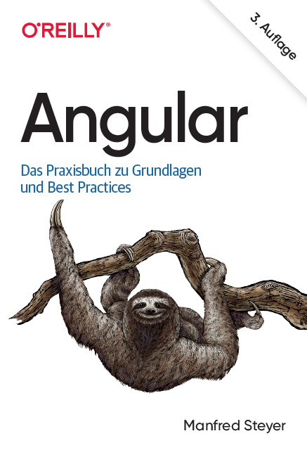
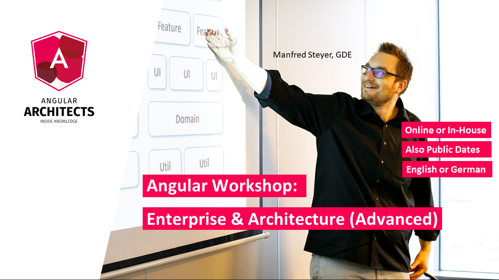

# Nächste Schritte

## Unser Angular-Buch bei O'Reilly

Falls Ihnen die Art und Weise, wie wir die Entwicklung mit Angular in diesem Buch erklären, werden Sie auch unser "großes" Angular-Buch bei O'Reilly mögen:

{width=50%}

Es liegt mittlerweile in der 3. Auflage vor. [Alle Details finden sich hier](https://oreilly.de/produkt/angular-2/).

## Trainings und Consulting

Erfahren Sie mehr über Angular für große Unternehmens-Anwendungen in unserem [Advanced Online Workshop](https://www.angulararchitects.io/en/angular-workshops/advanced-angular-enterprise-architecture-incl-ivy/):

Sichern Sie sich Ihre Tickets jetzt für sich und Ihre Kollegen.

Darüber hinaus bieten wir folgende Themen als Teil unserer Schulungs- oder Beratungsworkshops an:

- Angular Workshop: Strukturierte Einführung
- Advanced Angular: Enterprise Solutions und Architektur
- Professional Angular Testing Workshop (Cypress, Just, etc.)
- Reaktive Architekturen mit Angular (RxJS and NGRX)
- Angular Review Workshop
- Angular Upgrade Workshop

Wenn Sie Fragen haben, können Sie gerne auf uns zukommen: [office@softwarararchitekt.at](mailto:office@softwarararchitekt.at).

Bleiben Sie mit uns in Kontakt, z. B. via [Twitter](https://twitter.com/manfredsteyer) oder [Facebook](https://www.facebook.com/manfred.steyer).